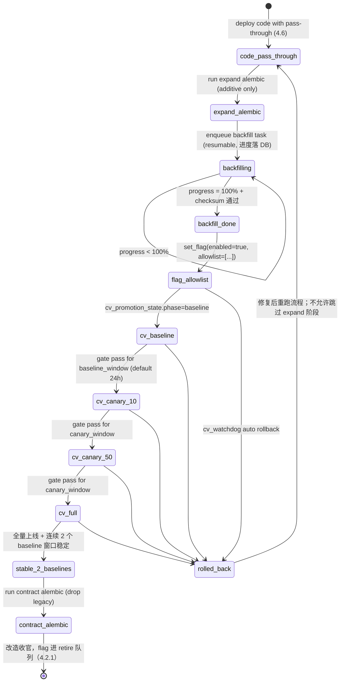
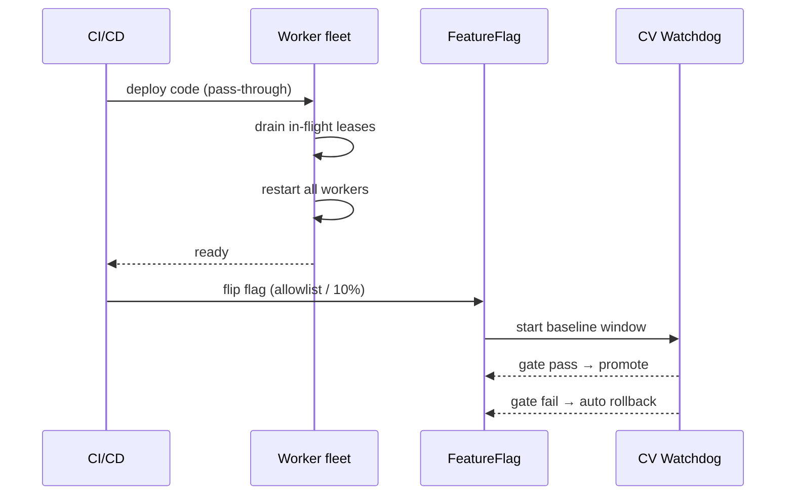
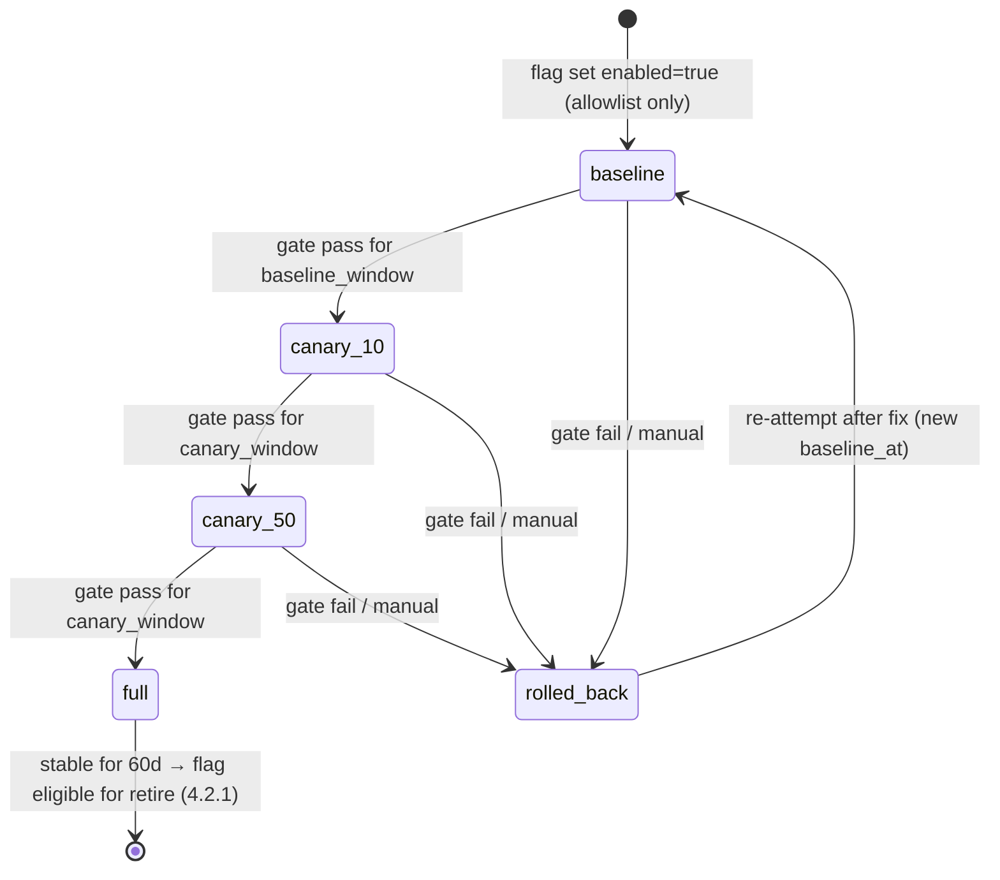
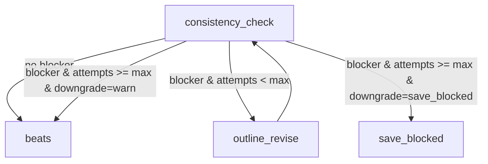
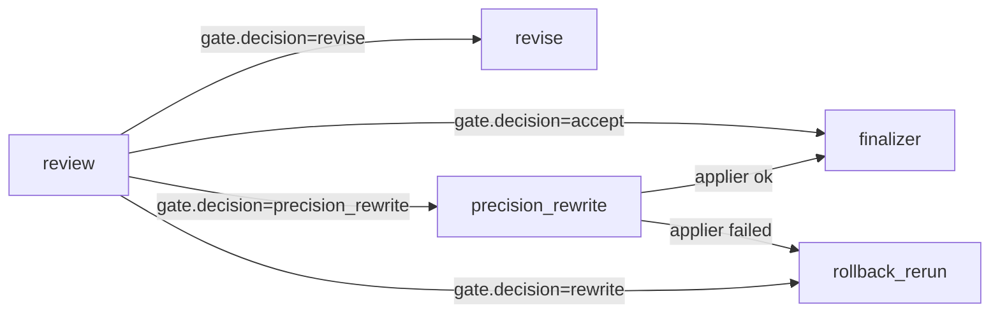
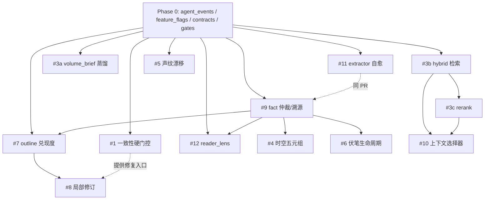

# AI-JinShu Agent 工程化优化路线图

| 字段 | 内容 |
|---|---|
| 文档版本 | v1.2 |
| 发布日期 | 2026-05-10 |
| 适用范围 | `app/services/generation/`、`app/services/memory/`、`app/services/agents/`、`app/models/novel.py`、`presets/` |
| 维护人 | _待指派_（建议：长篇生成主路径 owner + 平台基础设施 owner） |
| 状态 | Ready-to-build (P0 阻塞已清，可开 Phase 0 ticket) |

**变更日志**

- v1.2（2026-05-10，本次）：清理 v1.1 review 发现的 P0 / P1 阻塞——
  - 4.2 明确 GitOps + DB 副本配置模型（B1）；
  - 4.2 补 `set_flag` API + fail-close 语义（B2）；
  - 4.3.1 新增事件 payload 契约（agent_name × event_type → Pydantic schema 注册表）（B3）；
  - 第 2 章统一灰度策略由 CV Policy 自动驱动（B4）；
  - 4.7 补 phase 状态机图；4.8 新增 Strategy Fallback Chain 约定（B5）；
  - 11.3（原 12.3）补 `model_prices.yaml` schema + 明确 `cost_usd` 落 payload 不加列（B6 + B7）；
  - 4.5 末尾新增 Schema × Backfill × Flag × CV 全流程状态机（B8）；
  - 附录 B.5 开头补 chaos 注入工具栈对照表 + 生产/测试 注入开关说明（B10）；
  - 顶级章节重编号补齐 11 跳号：§12 Cost Governance → §11、§13 ADR → §12、§14 收尾 → §13；附录 ABC 仍保留 §8/§9/§10（B11）；
  - 已知遗留：第 5 章每条改造下的子节编号（如 `4.1 现状`）与 Phase 0 顶级 §4.x 撞号，markdown 渲染无影响但 grep 会混淆，留 v1.3 处理（B12）。
- v1.1（前次）：Harness-style governance（SLO / Error Budget / CV / Schema Evolution SOP / Graph Evolution / Cost Governance / ADR / Chaos）。
- v1.0：初版 12 条改造路线图。

---

## 1. 摘要

本路线图把当前生成主路径上的 12 个高 ROI 痛点，统一改造为"契约 + 门控 + 观测 + 回滚"四件套俱全的工程化能力，分 7 个 Phase 渐进交付。

- 目标：把 LLM 写小说从"靠 prompt 拼字符串 + try/except 兜底"升级为"结构化资产 + 显式门控 + 段落级修复 + 全链路可观测"。
- 收益（按类别量化预期）：
  - 一致性 blocker 实际命中率：从 0%（全部 soft-fail）→ 触发后进入修复回路，blocker 漏放比例预期下降至 < 5%。
  - 整章重写 token 消耗：通过段落级 patch（#8）预期下降 60%+。
  - 长程检索召回质量：Hybrid + Rerank（#3b/#3c）预期把 top-5 命中率从 ~55% 拉到 80%+。
  - 事实污染：FactExtractor 自愈（#11）+ 仲裁（#9）后预期把跨章矛盾 must_fix 率减半。
- 关键约束：所有改造必须可灰度（feature flag 默认关）、可回滚（数据软删除而非硬覆盖）、可观测（事件落 `agent_events` 表 + Prometheus metric）。
- SLI / SLO / Error Budget：每条改造的目标契约都用可观测指标定义，并通过统一的 Continuous Verification policy 自动 promote / rollback。

阅读建议：

- 新加入工程师：从第 3 章工程化总原则 → 第 4 章 Phase 0 → 第 6 章路线图，再按你被分到的 ticket 跳转到第 5 章对应小节。
- 架构 review：直接看第 3、4、6、7 章。
- DB owner：重点扫第 4.1（agent_events DDL）、第 5 章每条的"Schema 改造"小节、附录 A。

---

## 2. 文档约定

- 代码引用统一用 `startLine:endLine:filepath` 或 `filepath:line` 格式。
- DDL 草案可直接抄进 alembic 脚本（字段命名、`updated_at` 等遵循 `app/models/novel.py` 已有约定）。
- prompt 文件统一放在 `app/prompts/templates/*.j2`，加载入口 `app/prompts.render_prompt(...)`。
- 路线图中"灰度策略"统一指：feature flag 默认关 → 内部白名单（指定 novel_id 列表）→ 10% novel 按 hash 灰度 → 50% → 全量。**所有推档由 `cv_watchdog` 按 6.4 CV Policy 自动决策（默认每 phase 24h baseline 窗口），人工只能拒绝推档或触发紧急回滚，不能强行加速**；详见 6.3 / 6.4。
- Flag 配置采用 **GitOps + DB 副本** 模式（详见 4.2）：`presets/flags/<name>.yaml` 是 source-of-truth，DB `system_settings.flag.*` 是运行时副本，`cv_watchdog` / 紧急回滚 API 只能改 DB 副本并同步反写 yaml PR；任何只改 DB 而不留 yaml 痕迹的 toggle 视为 incident。
- schema 演化遵循 expand → migrate → contract 三段式（见 4.5）。
- Graph 节点新增遵循 pass-through-then-flip 部署模式（见 4.6）。

---

## 3. 工程化总原则

下表是贯穿全部 12 条改造的总原则。每条改造的"目标契约"小节都必须能用这张表里的"工程化版"列对照打勾。

| 原则 | 玩具版（当前） | 工程化版（目标） |
|---|---|---|
| 契约 | dict + 注释 | Pydantic Schema + JSON Schema 校验 + `schema_version` 字段 |
| 失败 | `try/except` + log | 失败落 `quality_reports` + `error_code` + 自动重试矩阵（含替补 model） |
| 门控 | `if score > 0.8` 硬编码 | `presets/gates/*.yaml` + per-novel override + DB 热重载（5s TTL） |
| 修复 | 整章重跑 | 段落级 patch + 最小增量重生成（带 anchor 校验） |
| 数据 | prompt 拼字符串 | 结构化资产（带 `source` / `confidence` / `superseded_by` / `is_active`） |
| 观测 | 散落的 `logger.info` | 统一 `agent_events` 表 + Prometheus metric + `trace_id` 串联 |
| 回滚 | 直接 UPDATE 覆盖 | `revision` + `superseded_by` 软删除 + 每条改造一个独立 feature flag |
| 测试 | 几个集成 happy path | 契约 fixture + 重放回放（chapter draft 黄金集）+ 行为基线快照 |
| 治理 | 人工盯盘 + 散落工单 | SLO / Error Budget + Continuous Verification 自动 promote/rollback + Flag lifecycle 强制退役 |

简短解读：

- **契约**：每个 agent（writer / reviewer / fact extractor / outline auditor / patch writer）的输入输出都用 Pydantic 定义并打版本号。后续 schema 演进只允许 additive，breaking change 必须升 `schema_version` 并保留兼容代码。
- **失败**：任何 LLM 调用失败、解析失败、校验失败都必须有结构化落地（`agent_events` + `fact_extraction_failures` 等专表），禁止 silent skip。
- **门控**：所有"是否 blocker / 是否触发重写 / 重试次数 / 降级行为"都从 yaml 读，禁止散落的 `if score > 0.8`。
- **修复**：默认尝试段落级 patch，失败再回退到整章重写。
- **数据**：StoryFact、StoryForeshadow、character voice profile 等都按"事实+证据+置信度+生效区间"维度建模。
- **观测**：`X-Trace-Id` 串穿 API → Celery → graph 节点 → agent 调用，所有关键决策事件都落 `agent_events`。
- **回滚**：每条改造独立 flag，能在不重启服务的前提下随时退回旧路径。
- **测试**：建立"章节草稿黄金集 + 期望行为快照"，所有改造必须先在重放集上不退化才能上线。
- **治理**：每条改造都要有 SLI / SLO / Error Budget 定义；rollout 推档由 promotion gate 自动判断；flag 必须挂 owner 和退役日期，超龄进红色清单。

---

## 4. Phase 0：通用基础设施（前置必做）

Phase 0 是后续 12 条改造的地基，**必须先做完**。所有 agent 决策事件、feature flag 切换、契约校验失败、门控阈值都依赖这一层。

### 4.1 `agent_events` 表（统一事件落库）

**目的**：所有"agent 调用 / 检测决策 / 修复尝试 / 失败兜底"都落到同一张事件表。前端面板、自动化告警、回归测试基线都从这张表查。

**Schema 草案（alembic 迁移示例）**：

```python
from alembic import op
import sqlalchemy as sa
from sqlalchemy.dialects.postgresql import JSONB

def upgrade() -> None:
    op.create_table(
        "agent_events",
        sa.Column("id", sa.BigInteger, primary_key=True, autoincrement=True),
        sa.Column("trace_id", sa.String(64), nullable=True, index=True),
        sa.Column("novel_id", sa.Integer, sa.ForeignKey("novels.id", ondelete="CASCADE"), nullable=False, index=True),
        sa.Column("novel_version_id", sa.Integer, sa.ForeignKey("novel_versions.id", ondelete="CASCADE"), nullable=True, index=True),
        sa.Column("task_id", sa.String(255), nullable=True, index=True),
        sa.Column("chapter_num", sa.Integer, nullable=True, index=True),
        sa.Column("agent_name", sa.String(64), nullable=False),       # writer / reviewer / fact_extractor / outline_auditor / patch_writer ...
        sa.Column("event_type", sa.String(64), nullable=False),       # invoke / decision / failure / retry / patch_applied ...
        sa.Column("verdict", sa.String(32), nullable=True),           # pass / warn / fail / skipped / patched
        sa.Column("error_code", sa.String(64), nullable=True),
        sa.Column("error_category", sa.String(32), nullable=True),    # transient / permanent / policy
        sa.Column("duration_ms", sa.Integer, nullable=True),
        sa.Column("input_tokens", sa.Integer, nullable=True),
        sa.Column("output_tokens", sa.Integer, nullable=True),
        sa.Column("payload", JSONB, server_default="{}"),
        sa.Column("created_at", sa.DateTime(timezone=False), server_default=sa.func.now(), nullable=False),
    )
    op.create_index("ix_agent_events_novel_chapter_time", "agent_events", ["novel_id", "chapter_num", "created_at"])
    op.create_index("ix_agent_events_agent_event_time", "agent_events", ["agent_name", "event_type", "created_at"])
```

**SQLAlchemy 模型（放 `app/models/novel.py` 末尾）**：

```python
class AgentEvent(Base):
    """Unified agent event log (decisions, failures, patches)."""
    __tablename__ = "agent_events"

    id = Column(BigInteger, primary_key=True, autoincrement=True)
    trace_id = Column(String(64), nullable=True, index=True)
    novel_id = Column(Integer, ForeignKey("novels.id", ondelete="CASCADE"), nullable=False, index=True)
    novel_version_id = Column(Integer, ForeignKey("novel_versions.id", ondelete="CASCADE"), nullable=True, index=True)
    task_id = Column(String(255), nullable=True, index=True)
    chapter_num = Column(Integer, nullable=True, index=True)
    agent_name = Column(String(64), nullable=False)
    event_type = Column(String(64), nullable=False)
    verdict = Column(String(32), nullable=True)
    error_code = Column(String(64), nullable=True)
    error_category = Column(String(32), nullable=True)
    duration_ms = Column(Integer, nullable=True)
    input_tokens = Column(Integer, nullable=True)
    output_tokens = Column(Integer, nullable=True)
    payload = Column(JSON, default=dict)
    created_at = Column(DateTime, default=_utc_now)
```

**写入接口（放 `app/services/agents/events.py`，新模块）**：

```python
def emit_agent_event(
    *,
    agent_name: str,
    event_type: str,
    novel_id: int,
    chapter_num: int | None = None,
    trace_id: str | None = None,
    task_id: str | None = None,
    verdict: str | None = None,
    error_code: str | None = None,
    error_category: str | None = None,
    duration_ms: int | None = None,
    input_tokens: int | None = None,
    output_tokens: int | None = None,
    payload: dict | None = None,
    db: Session | None = None,
) -> None:
    """统一事件入口。失败必须 swallow（写日志即可），不能阻塞主路径。"""
```

**使用约束**：

- 主路径节点（writer / reviewer / consistency_check / cross_chapter_check / outline_audit / patch_writer 等）每次决策都要 emit。
- 失败 emit 必须包含 `error_code`（参考 `app/models/novel.py:213` 已有 `error_code` 命名规范）。
- emit 失败本身不能抛异常，必须在 `try/except` 里 swallow。

**Prometheus 桥接**：在 `emit_agent_event` 内部同步 inc 一组 counter（`agent_events_total{agent,event_type,verdict}`）。

**分区与 retention**：

- **分区**：按 `created_at` 月度分区（PostgreSQL declarative partitioning），单分区不超过 50M 行。
- **Retention**：默认保留 90 天活跃分区 + 365 天压缩归档；超期数据归档到对象存储（如 S3）由 Celery beat 处理。
- **基数控制**：`novel_id` / `character_id` 等高基数维度只放在事件表 `payload`，**禁止**进 Prometheus label。

### 4.2 Feature Flag 服务

**目的**：每条改造都挂一个 flag，默认关。线上灰度、紧急回滚、per-novel 调试全靠它。

**配置模型（GitOps + DB 副本）**：

- **Source of truth**：`presets/flags/<name>.yaml`（每 flag 一个文件，CODEOWNERS 强制 PR review）。
- **运行时副本**：`system_settings` 表 `flag.<name>` key（`is_enabled` 实际读这里，含 5s TTL 缓存）。
- **同步方向**：
  1. **正向**（yaml → DB）：CI / Celery beat `flag_yaml_sync_task` 每 1 分钟把 yaml 推到 DB；部署时也跑一次。
  2. **反向**（DB → yaml）：`cv_watchdog` 自动 rollback 或紧急回滚 API 只能改 DB 副本，但**必须**在 5 分钟内自动开一个 yaml back-sync PR（含 reason / changed_by），由 owner 合入闭环。
- **任何只改 DB 而不留 yaml PR 痕迹的 toggle 视为 incident**，由 4.2.1 lifecycle audit 周扫报警。

**实现**：`app/core/feature_flags.py`，DB-backed 读，5s TTL 缓存（直接复用 `app/services/system_settings/runtime.py:21` 的 `_CACHE_TTL_SECONDS = 5.0` 模式）。

**Schema（复用 `system_settings` 表，新增一种 setting key 前缀 `flag.*`，与 yaml schema 同形）**：约定 `flag.<name>` 存（必填字段全部要求）：

```json
{
  "enabled": false,
  "rollout_pct": 0,
  "novel_allowlist": [],
  "owner": "team:generation-pipeline",
  "created_at": "2026-05-10",
  "purpose": "...",
  "target_full_rollout_at": "...",
  "expected_removal_at": "...",
  "depends_on": ["other.flag.name"]
}
```

**接口签名**：

```python
def is_enabled(flag_name: str, *, novel_id: int | None = None) -> bool:
    """灰度逻辑：
    1. flag 服务自身故障（DB / 缓存均不可达）→ fail-close 返回 False（默认走旧路径，绝不 fail-open）。
    2. 命中 novel_allowlist → 返回 True
    3. 否则 hash(novel_id) % 100 < rollout_pct → 返回 True
    4. 否则返回全局 enabled
    """

def invalidate_flags_cache(flag_name: str | None = None) -> None:
    """清缓存。flag_name=None 时清全部。set_flag 必须同步广播到全 worker（通过 Redis pub/sub 或 DB notify）。"""

def set_flag(
    flag_name: str,
    *,
    enabled: bool | None = None,
    rollout_pct: int | None = None,
    novel_allowlist: list[int] | None = None,
    changed_by: str,                # "cv_watchdog" | "user:<email>" | "ci:rollout-bot" | "incident:<id>"
    reason: str,                    # 必填，进 flag_audit_log.reason
) -> None:
    """改 DB 副本 + 写 flag_audit_log + 触发 invalidate_flags_cache 广播 + 入队 yaml back-sync。
    禁止在主路径中调用（只能 cv_watchdog / admin API / 紧急回滚 CLI 调用）。"""
```

**全部 12 条改造的 flag 命名（默认全部关）**：

| flag_name | 对应改造 |
|---|---|
| `consistency.blocker_hard_gate` | #1 |
| `consistency.alias_registry_v1` | #2 |
| `memory.volume_brief_distill` | #3a |
| `memory.hybrid_search` | #3b |
| `memory.cross_encoder_rerank` | #3c |
| `consistency.spacetime_v1` | #4 |
| `quality.voice_drift_audit` | #5 |
| `consistency.foreshadow_lifecycle_v1` | #6 |
| `quality.outline_promise_audit` | #7 |
| `repair.precision_rewrite` | #8 |
| `memory.fact_arbitration_v1` | #9 |
| `memory.context_embedding_score` | #10 |
| `extractor.self_heal` | #11 |
| `quality.reader_lens_audit` | #12 |

#### 4.2.1 Flag Lifecycle

- 退役条件：全量上线持续 60 天 + 无回滚事件 + 对应代码分支已可清理。
- 每周 Celery beat `flag_lifecycle_audit_task` 扫超龄 flag → 进 admin 红色清单。
- 每次 toggle 都落 `flag_audit_log` 表。
- 生产环境 toggle 走 GitHub CODEOWNERS 守 `presets/flags/` 路径，强制 PR review。

`flag_audit_log` DDL：

```sql
CREATE TABLE flag_audit_log (
    id            BIGSERIAL PRIMARY KEY,
    flag_name     VARCHAR(128) NOT NULL,
    changed_by    VARCHAR(128) NOT NULL,
    before_state  JSONB NOT NULL DEFAULT '{}',
    after_state   JSONB NOT NULL DEFAULT '{}',
    reason        TEXT,
    changed_at    TIMESTAMP NOT NULL DEFAULT now()
);
CREATE INDEX ix_flag_audit_log_flag_time ON flag_audit_log(flag_name, changed_at DESC);
```

### 4.3 契约目录 `app/services/agents/contracts/`

**目的**：每个 agent 的输入输出契约集中放，配 `schema_version`。所有 LLM 输出都先过 Pydantic 校验，校验失败进重试矩阵。

**目录结构**：

```
app/services/agents/contracts/
  __init__.py              # 导出所有契约
  base.py                  # AgentInput / AgentOutput 基类，含 schema_version、trace_id
  fact.py                  # FactRecord、FactArbitrationDecision（#9）
  outline.py               # OutlineContract、OutlineAuditReport（#7）
  consistency.py           # ConsistencyReportV2、BlockerEntry（#1）
  foreshadow.py            # ForeshadowLifecycleEntry、PlantPayoffMatch（#6）
  spacetime.py             # SpacetimeAnchor（#4）
  patch.py                 # EditSpan、PatchInstruction、PatchResult（#8）
  voice.py                 # VoiceFingerprint、VoiceDriftReport（#5）
  reader_lens.py           # ReaderLensVerdict（#12）
```

**基类草案**：

```python
from pydantic import BaseModel, Field
from typing import Literal

class AgentInput(BaseModel):
    schema_version: Literal["v1"] = "v1"
    trace_id: str | None = None
    novel_id: int
    chapter_num: int | None = None

class AgentOutput(BaseModel):
    schema_version: Literal["v1"] = "v1"
    verdict: Literal["pass", "warn", "fail", "skipped"] = "pass"
    issues: list[dict] = Field(default_factory=list)
```

**约束**：

- 任何 LLM 调用前必须组装一个 `AgentInput` 子类实例；任何 LLM 输出必须先 Pydantic parse，parse 失败进 `agent_events` 失败事件 + 替补 model 重试矩阵。
- breaking change 必须升 `schema_version`，旧版本兼容期至少 4 周。

#### 4.3.1 事件 payload 契约（强约束）

`agent_events.payload` 虽然落 JSONB，但**每个 `(agent_name, event_type)` 组合必须对应一个 Pydantic 契约**，写入前 `model_validate`，校验失败 swallow 但 emit 一条 `error_code=payload_schema_violation` 的元事件。前端面板、CV gate、回归断言全部按这些契约消费 payload，**禁止**直接读 raw dict。

目录：

```
app/services/agents/contracts/events/
  __init__.py                   # 注册 (agent_name, event_type) → schema 映射
  consistency_check.py          # ConsistencyCheckPayload, ReviseAttemptPayload, SaveBlockedPayload, DowngradePayload
  fact_extractor.py             # FactInvokePayload, FactFailurePayload, FactRetryPayload
  fact_arbitrator.py            # FactDecisionPayload
  outline_auditor.py            # OutlineAuditPayload
  patch_writer.py               # PatchAttemptPayload, PatchAppliedPayload, PatchRejectedPayload
  ...                           # 每个 agent 一个文件
```

**契约示例（`consistency_check.py`）**：

```python
class ReviseAttemptPayload(BaseModel):
    schema_version: Literal["v1"] = "v1"
    attempt: int                       # 第几次 revise（从 1 起）
    blocker_categories: list[str]      # 触发 revise 的 blocker 分类
    blocker_count: int
    outline_diff_chars: int            # 修订前后字符数差
    fallback_model_used: bool = False

class SaveBlockedPayload(BaseModel):
    schema_version: Literal["v1"] = "v1"
    final_blockers: list[str]
    revise_attempts_total: int
    downgrade_reason: Literal["max_revise_exceeded", "yaml_downgrade", "manual"]
```

**注册映射（`__init__.py`）**：

```python
EVENT_PAYLOAD_REGISTRY: dict[tuple[str, str], type[BaseModel]] = {
    ("consistency_check", "revise_attempt"): ReviseAttemptPayload,
    ("consistency_check", "save_blocked"): SaveBlockedPayload,
    # ... 全部映射在此声明
}
```

**写入侧**：`emit_agent_event` 内部根据 `(agent_name, event_type)` 查表 → `model_validate(payload)` → 校验通过才落库；校验失败时 swallow 主事件、另 emit 一条 `agent_name=agent_events_meta, event_type=schema_violation`。

**消费侧**：前端 / CV gate 调 `parse_event_payload(event)` 反向查表强类型化，禁止 raw dict 访问。

**演进**：新增改造时**同 PR** 提交 payload 契约 + 注册条目；CI 加测试断言所有 `emit_agent_event` 调用点的 `(agent_name, event_type)` 都在 registry 中。

### 4.4 门控配置 `presets/gates/*.yaml`

**目的**：把所有"什么是 blocker / 什么时候降级 / 重试几次 / 阈值"集中到 yaml，禁止硬编码。

**目录**：

```
presets/gates/
  consistency.yaml         # #1
  foreshadow.yaml          # #6
  outline_audit.yaml       # #7
  precision_rewrite.yaml   # #8
  fact_arbitration.yaml    # #9
  voice_drift.yaml         # #5
  reader_lens.yaml         # #12
```

**统一字段约定（样例 `consistency.yaml`）**：

```yaml
schema_version: 1
gates:
  character_existence:
    mode: strict           # strict | warn | off
    threshold: null
    max_outline_revise: 2  # 命中后允许 outline 重写次数
    downgrade_to: warn     # 超过 max_outline_revise 后降级
    metric_label: "consistency.character_existence"
  hard_constraint:
    mode: strict
    max_outline_revise: 2
    downgrade_to: save_blocked
    metric_label: "consistency.hard_constraint"
  foreshadow_unplanted:
    mode: warn
    metric_label: "consistency.foreshadow_unplanted"
  timeline_jump:
    mode: warn
    metric_label: "consistency.timeline_jump"
overrides:
  per_novel:
    # 12345:
    #   character_existence:
    #     mode: warn
```

**加载器**：`app/core/gates.py` 新模块，5s TTL 缓存，热重载，单元测试覆盖每个 mode 的路径行为。

**接口签名**：

```python
def get_gate(category: str, *, novel_id: int | None = None) -> GateConfig: ...

class GateConfig(BaseModel):
    mode: Literal["strict", "warn", "off"]
    max_outline_revise: int = 0
    downgrade_to: str | None = None
    threshold: float | None = None
```

#### 4.4.1 Policy as Code 校验

- 所有 `presets/gates/*.yaml` 必须有 Pydantic 校验器（用 `pydantic` 加载 + `Literal` 限定 `mode` 取值）。
- 加 pre-commit hook 和 CI job：yaml schema 不合规直接 CI fail。
- 改 yaml 走 GitHub CODEOWNERS 强制 review。

Pydantic schema 校验器骨架：

```python
from pydantic import BaseModel, Field
from typing import Literal

class GateCategoryConfig(BaseModel):
    mode: Literal["strict", "warn", "off"]
    threshold: float | None = None
    max_outline_revise: int = 0
    downgrade_to: str | None = None
    metric_label: str

class GateFile(BaseModel):
    schema_version: Literal[1] = 1
    gates: dict[str, GateCategoryConfig]
    overrides: dict[str, dict[str, dict[str, GateCategoryConfig]]] = Field(default_factory=dict)
```

### 4.5 Schema Evolution SOP

每个 alembic 迁移必须分两段 PR，不允许 expand 与 contract 在同一 PR：

- **Expand PR**：新字段 nullable + default，旧字段保留；代码双写新旧字段、读仍走旧字段；alembic 文件命名 `<feature>_expand_<rev>.py`。
- **Migrate 阶段（无 alembic）**：通过 feature flag 切读新字段，灰度结束再进入 contract。
- **Contract PR**：清理旧字段 + 旧代码；alembic 命名 `<feature>_contract_<rev>.py`；至少在全量上线 + 2 个 CV baseline 窗口稳定后才能跑 contract。

#### 示例：#9 fact 改造的 expand / contract 拆分

- **Expand PR**：在 `story_facts` 上新增 7 个字段（`source_chapter` / `source_run_id` / `source_kind` / `confidence` / `extractor_model` / `verified_chapter` / `superseded_by` / `is_active`，全部 nullable + server_default），新增 `ix_story_facts_entity_active` 索引；写库代码同时填写新字段，但 `_build_story_bible_context` 仍读全部 fact。
- **Migrate**：`memory.fact_arbitration_v1` flag 灰度推档；`_build_story_bible_context` 读路径切到 `is_active=true`。
- **Contract PR**：在全量稳定 + 连续 2 个 CV baseline 窗口（默认 24h × 2）通过后，删除旧 append 路径、收紧 `is_active` / `confidence` 为 `NOT NULL` 且无 default。如有冗余的 `revision` 字段也在此阶段清理。

强约束：

- 禁止 expand 与 contract 在同一 PR。
- 禁止 contract 在 flag 关闭状态下跑（contract 必须建立在已经稳定切到新路径的事实之上）。

#### Schema × Backfill × Flag × CV 全流程状态机

下图把 4.5（schema 演化）、4.6（graph 演化）、4.7（CV 推档）和第 5 章每条改造的 `Backfill 计划` 串成单一状态机，**任何引入新表 / 新字段 / 新节点的改造都按此走**。任何越级（如 backfill 未完成就开 flag）都视为 incident。



**关键约束**：

- `backfilling` → `flag_allowlist` 之间必须有"backfill 完成 100% + checksum 通过"事件落 `agent_events`，CI 校验存在该事件后才能调 `set_flag(enabled=true)`。
- `contract_alembic` 阶段如果回滚，**只能通过新 expand PR 加回字段**，禁止直接回写 contract 之前的代码（已删除的字段不会自己长回来）。
- 所有 backfill 任务必须可中断 / 可断点续跑 / 进度落库，禁止"长事务一把梭"。

### 4.6 Graph 演化 SOP

- LangGraph 编译为 module-level singleton（参见 `app/services/generation/graph.py`），结构变更需重启全 worker。
- 每条改造引入新节点时**必须遵循 pass-through-then-flip 模式**：
  1. 新节点上线时检查 `is_enabled(flag)`，flag-off 时 `return {}`（不修改 state）。
  2. 路由分支也要在 flag-off 时跳过新分支。
  3. 部署顺序：**先全 worker 升级代码（保持 pass-through）→ 等所有进程稳定 → 再开 flag**。
- 滚动重启 SOP：通过 `task_runtime/lease_service.py` 等待 in-flight task lease 释放后再重启 worker；**同一 task 不允许跨 worker / 跨版本续跑**。

部署时序：



### 4.7 Continuous Verification 基础设施（与 6.4 政策呼应）

- 新表 `cv_promotion_state`：跟踪每个 flag 的 `baseline_at` / `current_canary_pct` / `last_check_at` / `verdict`。
- 新 Celery beat `cv_watchdog_task`，每 5 分钟扫所有 active rollout。

`cv_promotion_state` DDL：

```sql
CREATE TABLE cv_promotion_state (
    id                  BIGSERIAL PRIMARY KEY,
    flag_name           VARCHAR(128) NOT NULL,
    phase               VARCHAR(32) NOT NULL,   -- baseline | canary_10 | canary_50 | full | rolled_back
    baseline_at         TIMESTAMP,
    current_canary_pct  INTEGER NOT NULL DEFAULT 0,
    last_check_at       TIMESTAMP,
    verdict             VARCHAR(32),            -- pending | promote | hold | rollback
    payload             JSONB NOT NULL DEFAULT '{}',
    created_at          TIMESTAMP NOT NULL DEFAULT now(),
    updated_at          TIMESTAMP NOT NULL DEFAULT now(),
    UNIQUE (flag_name)
);
CREATE INDEX ix_cv_promotion_state_phase ON cv_promotion_state(phase, last_check_at);
```

watchdog 决策接口签名：

```python
def evaluate_promotion(flag_name: str) -> "PromotionDecision":
    """读取 cv_promotion_state + 当前 baseline / canary 窗口的 metric，
    依据 presets/cv/<flag_name>.yaml 推断 promote / hold / rollback。"""
```

phase 状态机（由 `cv_watchdog_task` 驱动，人工只能从任何 phase 触发 → `rolled_back`）：



### 4.8 Strategy Fallback Chain 约定

第 5 章 14 处 `LLM Failover` 段引用的 `outliner.fallback_a` / `cheap_judge.fallback_b` 等命名，**统一在 `presets/strategies/<key>.yaml` 中按下列结构扩展**（不写具体 model 名，model 来自 DB 运行时配置 + 价格表）。

```yaml
# presets/strategies/<key>.yaml 扩展字段（向后兼容，旧 yaml 保持 expand 期可读）
schema_version: 2
stages:
  outliner:
    primary:
      provider_ref: "${default}"          # 走运行时主 model；或显式 provider/model
      timeout_ms: 30000
    fallback_a:
      provider_ref: "${fallback_premium}"
      timeout_ms: 30000
    fallback_b:
      provider_ref: "${fallback_cheap}"
      timeout_ms: 20000
    circuit_breaker:
      consecutive_failures_to_open: 3
      cooldown_minutes: 60
      half_open_probe_ratio: 0.1
  writer: { ... }
  reviewer: { ... }
  extractor: { ... }
  cheap_judge: { ... }                    # 离线评估专用（#12 等用）
```

**Pydantic 校验器**（与 4.4.1 同样要求加 pre-commit + CI）：

```python
class StageFallback(BaseModel):
    schema_version: Literal[2] = 2
    primary: "StageEndpoint"
    fallback_a: "StageEndpoint"
    fallback_b: "StageEndpoint"
    circuit_breaker: "CircuitBreakerConfig"

class CircuitBreakerConfig(BaseModel):
    consecutive_failures_to_open: int = Field(ge=1, le=10)
    cooldown_minutes: int = Field(ge=1, le=240)
    half_open_probe_ratio: float = Field(ge=0.0, le=1.0)
```

**调用约束**：

- 所有走 `app/core/llm.py` 的调用必须经 `get_stage_runner(stage_name)` 包装，runner 内置 primary → fallback_a → fallback_b 的 try chain + 熔断器状态 + 每次尝试 emit 一条 `agent_events`（`event_type=invoke|fallback|circuit_open|circuit_half_open`）。
- 直接 `get_llm()` 在主路径中**禁止**使用（CI lint 强制）。
- 熔断器状态走进程内 + Redis 共享，避免单 worker 计数过低。

---

## 5. 改造点 1–12

每条改造严格按 10 个小节展开。Phase 0 假设已完成；下文中所有"emit_agent_event"和"is_enabled(flag)"调用都默认走第 4 章基础设施。

---

### #1 一致性 blocker 硬门控 + 自修复回路

#### 1.1 现状与问题

- `app/services/generation/consistency.py:573` `inject_consistency_context` 把 blocker 文案塞进 prompt，但仅作为约束提示，写作 agent 是否真的尊重不可保证。
- `app/services/generation/nodes/chapter_loop.py:220` 写死 `consistency_soft_fail: True`，graph 路由 `app/services/generation/graph.py:57` `_route_consistency` 直接 `return "beats"`，blocker 实际不挡。
- 结果：硬约束（如"角色 A 已死亡却出现在大纲"）触发 blocker 后只是日志里抱怨，章节照常生成。

#### 1.2 目标契约

- blocker 触发 → 进入 outline 修订循环（最多 N 次）→ 仍 blocker 则按 yaml 配置降级（save_blocked / warn）。
- 全程结构化：blocker 进 `agent_events`，outline_revise 尝试次数进 `quality_reports.metrics_json.consistency_v2`。
- 工程化达标条件：`presets/gates/consistency.yaml` mode 切换可在不发版的前提下生效；blocker 不能再 silent pass。

**SLI / SLO / Error Budget**

- SLI：`consistency_blocker_recall = 1 - silent_passed_blockers / total_blockers`
- SLO：30 天滚动窗口 ≥ 0.95
- Error Budget：5% / 30d
- Burn Rate Alert：1h 烧光 1d 预算 → P1，6h 烧光 1d 预算 → P2

**LLM Failover**

- 主 model 来源：`presets/strategies/<key>.yaml` 的 `outliner` stage（`outline_revise` 复用同 stage）。
- Fallback chain：至少 2 个 fallback model，按 stage 名解析（`outliner.fallback_a` / `outliner.fallback_b`），不写具体 model 名。
- circuit breaker：连续 3 次 fallback 触发后，该 stage 整体暂时降配 1 小时。

#### 1.3 数据 / Schema 改造

- 新表（轻量）：复用 `agent_events`，不必单独建表。每次 `consistency_check` / `outline_revise` 进一条事件。
- `quality_reports.metrics_json` 新增字段：

  ```json
  {
    "consistency_v2": {
      "blockers": [{"category": "...", "message": "...", "first_seen_attempt": 0}],
      "outline_revise_attempts": 2,
      "final_decision": "save_blocked | downgraded | passed"
    }
  }
  ```

- 不需要 alembic 迁移（`metrics_json` 是 JSON 列）。

#### 1.4 节点 / 路由改造

新增节点 `node_outline_revise`（放 `app/services/generation/nodes/chapter_loop.py`）：

- 输入：当前 outline + blocker 列表 + 上下文。
- 调用新 prompt `app/prompts/templates/outline_revise_with_blockers.j2`，要求"严格在不破坏 outline_contract 的前提下修复 blocker 列出的问题"。
- 输出：修订后的 outline，写回 `state["outline"]`。

修改 `_route_consistency`（`app/services/generation/graph.py:57`）：



`state` 新增：`consistency_revise_attempts: int`（每次 `node_outline_revise` 自增）。

#### 1.5 配置 / Feature Flag

- flag：`consistency.blocker_hard_gate`，默认关。
- 关闭时：保留旧逻辑（`_route_consistency` 直接 `return "beats"`）。
- yaml：`presets/gates/consistency.yaml`（见 4.4 样例）。
- 灰度：内部 5 本测试小说 → rollout_pct=10 → 50 → 全量。

#### 1.6 可观测性

- 新增 metric：
  - `consistency_blocker_total{category}`（counter）
  - `consistency_outline_revise_attempts`（histogram）
  - `consistency_final_decision_total{decision}`（counter）
- `agent_events`：`agent_name=consistency_check`，`event_type ∈ {check, revise_attempt, save_blocked, downgrade}`。
- 前端面板：novel 详情页新增"一致性决策时序"组件（已有 `quality_reports` 拉取接口可复用）。

#### 1.7 测试基线

- 单元测试：`tests/test_consistency_route.py` 覆盖 4 条路径（pass / revise→pass / revise→max→save_blocked / revise→max→warn）。
- 契约测试：构造 blocker 报告 + outline，断言 `node_outline_revise` 输出的 outline 仍满足 `OutlineContract` schema。
- 回归 fixture：选 5 个历史 blocker 案例（角色死亡复活、伏笔倒序），断言修订后 blocker 消失。

#### 1.8 回滚开关

- flag 关 → `_route_consistency` 走旧逻辑。
- yaml `mode: off` → 任何 category 都不阻塞。

#### 1.9 依赖项

依赖 Phase 0 全部子项（agent_events / feature_flags / contracts / gates）。

---

### #2 中文实体识别精度（alias_registry 替代 NER）

#### 2.1 现状与问题

- `app/services/generation/consistency.py:18` `_NAME_EXCLUDE` 写死 12 个常见词。
- `app/services/generation/consistency.py:22` `_NAME_CONTEXT_PATTERNS` 仅 4 个正则，2–4 字汉字串当候选名。
- 结果：常见动词宾语（如"看望"前后）、地名、组织名误识别为人名；陌生角色识别召回率低。

#### 2.2 目标契约

- **不引入** NER 依赖到同步链路。
- outliner 必须维护 `character_aliases`，consistency 检查从"猜名字"变为"字典查询"。
- 工程化达标条件：陌生角色误报率 < 5%，召回率 ≥ 85%（黄金集 50 章）。

**SLI / SLO / Error Budget**

- SLI：`alias_resolution_precision @ 黄金集`
- SLO：30 天滚动窗口 ≥ 0.85
- Error Budget：15% / 30d
- Burn Rate Alert：1h 烧光 1d 预算 → P1，6h 烧光 1d 预算 → P2

#### 2.3 数据 / Schema 改造

- `chapter_outlines.metadata_` 新增结构化字段（不需 DDL，JSON 内）：

  ```json
  {
    "character_aliases": [
      {"canonical": "陈青云", "aliases": ["陈先生", "青云", "陈生"], "first_seen_chapter": 12}
    ]
  }
  ```

- `novel_specifications` 新增一条 `spec_type='alias_registry'`，content 为累积的 alias map。

#### 2.4 节点 / 路由改造

- 新模块：`app/services/memory/alias_registry.py`：

  ```python
  def register_alias(novel_id: int, canonical: str, aliases: list[str], first_seen_chapter: int) -> None: ...
  def resolve(novel_id: int, surface_form: str) -> str | None:
      """surface_form -> canonical 名字，找不到返回 None。"""
  def get_full_roster(novel_id: int) -> dict[str, list[str]]:
      """canonical -> [aliases]，供 consistency / cross_chapter_check 使用。"""
  ```

- `consistency.py` 改造：
  - `_build_full_roster`（当前 `consistency.py:53`）改为同时合并 spec characters + alias_registry。
  - `extract_unknown_characters`（`consistency.py:69`）减去整个 alias map 而不是只减 canonical。
- outliner 节点（`app/services/generation/nodes/`）：每次写完章节大纲，强制要求模型输出 `character_aliases` 字段（在 prompt 里硬性要求 + Pydantic schema 校验）。
- 第二阶段（仅当回归显示召回率 < 85% 才上）：引入 pkuseg 跑离线巡检 Celery 任务，输出 `alias_registry_audit_report`，**不进同步链路**。

#### 2.5 配置 / Feature Flag

- flag：`consistency.alias_registry_v1`，默认关。
- 关闭时：旧 `_build_full_roster` 行为不变。

#### 2.6 可观测性

- metric：
  - `alias_registry_size{novel_id}`（gauge）
  - `unknown_character_false_positive_rate`（gauge，每章计算）
- `agent_events`：`agent_name=alias_registry`，`event_type ∈ {register, resolve_miss}`。

#### 2.7 测试基线

- 单元测试：覆盖 surface_form 同名歧义（两人都叫"小王"）、空 registry、非中文 surface。
- 黄金集回归：10 本试验小说，每本人工标 30 个 surface_form ground truth，断言 resolve 命中 ≥ 85%。

#### 2.8 回滚开关

- flag 关；同时保留旧 `_NAME_EXCLUDE` 静态表作为兜底。

#### 2.9 依赖项

Phase 0；与 #9 没有强依赖，但建议晚于 #9 落（因为 #9 提供事实溯源，方便审计 alias 来源）。

---

### #3 长程语义记忆（拆三步走）

整体目标：把"近期摘要 + 卷级 brief + 知识库 chunk"三层都升级为可解释、可重排、可缓存的结构。

---

#### #3a volume_brief LLM 蒸馏 + 缓存

##### 3a.1 现状与问题

- `app/services/memory/summary_manager.py:89` 直接 `combined[:chars_per_volume]` 字符截断，丢失结构。
- 跨卷生成时模型只能看到"前 400 字"。

##### 3a.2 目标契约

- 每完成一卷 → 触发一次 LLM 蒸馏 → 落库 → 后续读取缓存。
- 三段式结构：`characters` / `conflicts` / `foreshadowing`。

**SLI / SLO / Error Budget**

- SLI：`volume_brief_distill_success_rate`
- SLO：30 天滚动窗口 ≥ 0.99
- Error Budget：1% / 30d
- Burn Rate Alert：1h 烧光 1d 预算 → P1，6h 烧光 1d 预算 → P2

**LLM Failover**

- 主 model 来源：`presets/strategies/<key>.yaml` 的 `summarizer` stage（蒸馏属于摘要类）。
- Fallback chain：至少 2 个 fallback model（`summarizer.fallback_a` / `summarizer.fallback_b`）。
- circuit breaker：连续 3 次 fallback 触发后，该 stage 整体暂时降配 1 小时。

##### 3a.3 数据 / Schema 改造

新表：

```sql
CREATE TABLE volume_briefs (
    id            BIGSERIAL PRIMARY KEY,
    novel_id      INTEGER NOT NULL REFERENCES novels(id) ON DELETE CASCADE,
    novel_version_id INTEGER REFERENCES novel_versions(id) ON DELETE CASCADE,
    volume_no     INTEGER NOT NULL,
    chapter_end   INTEGER NOT NULL,
    brief_jsonb   JSONB NOT NULL DEFAULT '{}',     -- {characters, conflicts, foreshadowing}
    source_run_id VARCHAR(64),
    schema_version SMALLINT NOT NULL DEFAULT 1,
    created_at    TIMESTAMP NOT NULL DEFAULT now(),
    UNIQUE (novel_version_id, volume_no, schema_version)
);
CREATE INDEX ix_volume_briefs_novel ON volume_briefs(novel_id, volume_no);
```

`brief_jsonb` 必须满足 Pydantic 契约 `VolumeBrief`（在 4.3 契约目录）：

```python
class VolumeBrief(BaseModel):
    schema_version: Literal[1] = 1
    characters: list[dict]   # {name, arc_progress, key_choices}
    conflicts: list[dict]    # {title, status, key_chapters}
    foreshadowing: list[dict] # {fid, planted_at, state}
```

**Backfill 计划**

- 新建一次性 Celery 任务 `backfill_volume_briefs_task`：扫所有已 finalize 的卷，按 `volume_size` 分批触发蒸馏；进度落 `backfill_progress` 表。
- 强约束：可暂停可续跑；backfill 完成前 flag 限制只对**新 novel** 开启。

##### 3a.4 节点 / 路由改造

- 新节点：`node_volume_brief_distill`，挂在 `closure_gate` 之后（`graph.py:_route_after_closure_gate` 内增一条分支）。
- 触发条件：`is_volume_start(state, current_chapter)` 为 True 且上一卷有 ≥1 章生成完。
- prompt：`app/prompts/templates/volume_brief_distill.j2`，输入近 30 章 summary，输出严格 JSON。
- `summary_manager.get_volume_brief` 改造：先读 `volume_briefs` 表，命中直接返回；未命中回退到原字符截断（兜底）。

##### 3a.5 配置 / Feature Flag

flag：`memory.volume_brief_distill`，默认关。

##### 3a.6 可观测性

- metric：`volume_brief_distill_duration_ms`（histogram）、`volume_brief_cache_hit_rate`（gauge）。
- `agent_events`：`agent_name=volume_brief_distiller`，`event_type ∈ {distill, cache_hit, cache_miss}`。

##### 3a.7 测试基线

- 单元测试：模型返回非法 JSON / 字段缺失时回退兜底。
- 回归 fixture：固定一段 30 章 summary 输入，断言 brief 字段稳定（用 LLM mock）。

##### 3a.8 回滚开关

flag 关。

##### 3a.9 依赖项

Phase 0。

---

#### #3b Hybrid 检索（BM25 + dense）

##### 3b.1 现状与问题

- `app/services/memory/vector_store.py:20` `search` 仅向量；向量失败时落到 `_lexical_rank`（`vector_store.py:119`）做 token 重叠兜底。
- 结果：人名、专有名词（embedding 区分度差）召回低。

##### 3b.2 目标契约

`knowledge_chunks` 加 `tsvector` 列 + GIN 索引；用 RRF（Reciprocal Rank Fusion）融合 BM25 与 dense 排序，单次查询返回 hybrid top-K。

**SLI / SLO / Error Budget**

- SLI：`search_recall_at_5_uplift_vs_dense`
- SLO：≥ +15pt（离线评估口径）
- Error Budget：离线评估 weekly
- Burn Rate Alert：连续 2 周低于 +15pt → P2 复盘

##### 3b.3 数据 / Schema 改造

```sql
ALTER TABLE knowledge_chunks
    ADD COLUMN content_tsv tsvector
    GENERATED ALWAYS AS (to_tsvector('simple', coalesce(content, ''))) STORED;
CREATE INDEX ix_knowledge_chunks_content_tsv ON knowledge_chunks USING GIN (content_tsv);
```

> 中文 BM25 tokenization 用 `simple` 字符级或额外引入 `pg_jieba`；初期用 `simple` + 空格切分，已能比纯向量好。

##### 3b.4 节点 / 路由改造

`vector_store.py` 重构：

```python
def search_hybrid(
    self,
    novel_id: int,
    novel_version_id: int,
    query_text: str,
    *,
    alpha: float = 0.6,            # dense 权重
    limit: int = 5,
    candidate_pool: int = 50,
) -> list[dict]:
    """
    1. dense 取 top-pool；2. BM25 取 top-pool；3. RRF 融合；4. 截 top-K。
    failure: 任何一路失败 → 退化到另一路；都失败 → 退化到 _lexical_rank。
    """
```

旧 `search()` 保留（内部判 `is_enabled('memory.hybrid_search')` 决定走哪条）。

##### 3b.5 配置 / Feature Flag

- flag：`memory.hybrid_search`，默认关；alpha 也从 yaml 读，便于离线调参。

##### 3b.6 可观测性

- metric：`memory_search_duration_ms{path=dense|bm25|hybrid}`、`memory_search_recall_at_5`（离线评估上报）。
- `agent_events`：`agent_name=vector_store`，`event_type=search`，payload 含 alpha、命中类型。

##### 3b.7 测试基线

- 50 个 (query, expected_chunk_id) 标注集，离线评估 recall@5。dense → hybrid 应至少 +15pt。
- 兜底测试：BM25 列被禁用时 hybrid 自动退化到 dense。

##### 3b.8 回滚开关

flag 关 → 走旧 `search()`。

##### 3b.9 依赖项

Phase 0；与 #3a 独立可并行。

---

#### #3c Cross-encoder Rerank

##### 3c.1 现状与问题

hybrid top-50 中仍有大量噪声（与 query 主题接近但具体语境不同）。

##### 3c.2 目标契约

引入 BGE-reranker-base ONNX，CPU 跑通即可，top-50 → top-5。**只在 worker 容器**部署，API 容器禁止加载。

**SLI / SLO / Error Budget**

- SLI：`rerank_recall_at_5_uplift_vs_hybrid`
- SLO：≥ +5pt（离线评估口径）
- Error Budget：离线评估 weekly
- Burn Rate Alert：连续 2 周低于 +5pt → P2 复盘

##### 3c.3 数据 / Schema 改造

无新表。`agent_events.payload` 记录 rerank 前后排名变化即可。

##### 3c.4 节点 / 路由改造

新模块：`app/services/memory/reranker.py`：

```python
class CrossEncoderReranker:
    def __init__(self, model_path: str, device: str = "cpu"): ...
    def rerank(self, query: str, candidates: list[dict], top_k: int = 5) -> list[dict]: ...
```

`search_hybrid` 后追加 rerank 步骤（`is_enabled('memory.cross_encoder_rerank')` 时启用）。

##### 3c.5 配置 / Feature Flag

flag：`memory.cross_encoder_rerank`。模型路径走环境变量 `RERANKER_MODEL_PATH`。

##### 3c.6 可观测性

- metric：`memory_rerank_duration_ms`、`memory_rerank_topk_swap_rate`（top5 与 hybrid top5 不同的比例）。

##### 3c.7 测试基线

- 与 #3b 共用标注集，断言 rerank 后 recall@5 再 +5pt。
- 性能基线：单次 rerank 50 候选 ≤ 800ms（CPU 8 核）。

##### 3c.8 回滚开关

flag 关 → 不加载模型。

##### 3c.9 依赖项

#3b 完成。

---

### #4 时空五元组（时间线建模）

#### 4.1 现状与问题

- `app/services/generation/consistency.py:388` `_check_timeline_conflicts` 仅识别"数月后/一年后"字符串。
- `StoryEvent` 表（`app/models/novel.py:281`）虽存在，但 `payload` 是松散 JSON，没有时间线维度。

#### 4.2 目标契约

每章抽取五元组 `(time, location, present_characters, key_events, time_advance)` 写入 `story_events.payload`，并物化一张 `story_timeline_anchors`，consistency 用 SQL 推理（不再 substring）。

**SLI / SLO / Error Budget**

- SLI：`spacetime_extract_success_rate`
- SLO：30 天滚动窗口 ≥ 0.90
- Error Budget：10% / 30d
- Burn Rate Alert：1h 烧光 1d 预算 → P1，6h 烧光 1d 预算 → P2

**LLM Failover**

- 主 model 来源：`presets/strategies/<key>.yaml` 的 `extractor` stage。
- Fallback chain：至少 2 个 fallback model（`extractor.fallback_a` / `extractor.fallback_b`）。
- circuit breaker：连续 3 次 fallback 触发后，该 stage 整体暂时降配 1 小时。

#### 4.3 数据 / Schema 改造

`story_events.payload` 子结构（写到 Pydantic 契约 `SpacetimeAnchor`）：

```json
{
  "time": {
    "absolute": "2024-09-15T08:00",
    "relative": "三日后",
    "uncertainty_days": 1
  },
  "location": "京城东市",
  "present_characters": ["陈青云", "苏白"],
  "time_advance_hours": 72,
  "scene_continuity": "direct"
}
```

新物化表（解决 SQL 推理）：

```sql
CREATE TABLE story_timeline_anchors (
    id               BIGSERIAL PRIMARY KEY,
    novel_id         INTEGER NOT NULL REFERENCES novels(id) ON DELETE CASCADE,
    novel_version_id INTEGER REFERENCES novel_versions(id) ON DELETE CASCADE,
    chapter_num      INTEGER NOT NULL,
    abs_time         TIMESTAMP NULL,
    abs_time_uncertainty_days INTEGER DEFAULT 0,
    location         VARCHAR(255),
    time_advance_hours INTEGER,
    source_event_id  BIGINT REFERENCES story_events(id) ON DELETE CASCADE,
    is_active        BOOLEAN NOT NULL DEFAULT TRUE,
    schema_version   SMALLINT NOT NULL DEFAULT 1,
    created_at       TIMESTAMP DEFAULT now(),
    UNIQUE (novel_version_id, chapter_num, schema_version)
);
CREATE INDEX ix_timeline_anchors_chapter ON story_timeline_anchors(novel_id, chapter_num);
```

**Backfill 计划**

- `backfill_spacetime_anchors_task`：扫所有 `chapter_versions`，sample 1/5 章先跑（成本控制），再按 SLO 决定是否全量。
- 强约束：可暂停可续跑；backfill 完成前 flag 限制只对**新 novel** 开启。

#### 4.4 节点 / 路由改造

- 新节点 `node_spacetime_extract`，挂在 `cross_chapter_check`（`app/services/generation/nodes/cross_chapter_check.py`）之后、`review` 之前。
- 新 prompt：`app/prompts/templates/spacetime_extract.j2`，要求严格 JSON。
- 重写 `_check_timeline_conflicts`（`consistency.py:388`）为 SQL 推理：
  - 拉前 N 章 anchors → 比较本章 outline 中暗示的 abs_time 或 time_advance；
  - 命中 → blocker 或 warn（按 yaml）。
- 配套 schema：`presets/gates/consistency.yaml` 新增 `timeline_v2` category。

#### 4.5 配置 / Feature Flag

flag：`consistency.spacetime_v1`，默认关。

#### 4.6 可观测性

- metric：`spacetime_extract_success_rate`、`spacetime_conflict_total{kind}`。
- `agent_events`：`agent_name=spacetime_extractor`。

#### 4.7 测试基线

- 单元测试：5 个固定 outline + bible 上下文，断言冲突检测命中预期。
- 抽取黄金集：10 章 ground truth anchors，准确率 ≥ 90%。

#### 4.8 回滚开关

flag 关 → 旧 `_check_timeline_conflicts` 字符串规则。

#### 4.9 依赖项

依赖 #9（事实置信度 + 溯源），因为 anchor 需要 `is_active` 软删除语义保持一致。

---

### #5 角色声纹漂移检测（离线巡检）

#### 5.1 现状与问题

- 主要角色台词风格在长篇里逐渐漂移（说"妾身"的角色后期开始说"我"），现有评估指标（`app/services/generation/evaluation_metrics.py`）未覆盖。
- 不能放进同步链路，会显著拖慢生成。

#### 5.2 目标契约

离线 Celery beat 任务定期扫所有主要角色台词，计算 stylometric 指纹漂移分；超阈值进 `quality_reports.warning`，**不阻塞** chapter loop。

**SLI / SLO / Error Budget**

- SLI：`voice_drift_warning_precision @ 抽检`
- SLO：30 天滚动窗口 ≥ 0.70
- Error Budget：30% / 30d
- Burn Rate Alert：1h 烧光 1d 预算 → P1，6h 烧光 1d 预算 → P2

#### 5.3 数据 / Schema 改造

```sql
CREATE TABLE character_voice_profiles (
    id                BIGSERIAL PRIMARY KEY,
    novel_id          INTEGER NOT NULL REFERENCES novels(id) ON DELETE CASCADE,
    novel_version_id  INTEGER REFERENCES novel_versions(id) ON DELETE CASCADE,
    character_id      INTEGER NOT NULL REFERENCES story_entities(id) ON DELETE CASCADE,
    baseline_jsonb    JSONB NOT NULL DEFAULT '{}',   -- 取首 5 次出场聚合
    latest_jsonb      JSONB NOT NULL DEFAULT '{}',
    drift_score       REAL DEFAULT 0,
    last_sampled_chapter INTEGER,
    schema_version    SMALLINT NOT NULL DEFAULT 1,
    updated_at        TIMESTAMP DEFAULT now(),
    UNIQUE (novel_version_id, character_id)
);
```

指纹结构（写到 Pydantic 契约 `VoiceFingerprint`）：

```json
{
  "avg_sentence_len": 18.4,
  "function_word_freq": {"的": 0.04, "了": 0.03},
  "modal_particle_freq": {"罢了": 0.012},
  "top_catchphrases": [["妾身愿往", 4], ["何足挂齿", 3]]
}
```

**Backfill 计划**

- `backfill_voice_baselines_task`：扫所有主要角色历史对话，建 `baseline_jsonb`，老角色 baseline 取首 5 次出场聚合。
- 强约束：可暂停可续跑；backfill 完成前 flag 限制只对**新 novel** 开启。

#### 5.4 节点 / 路由改造

- 不进 graph。新增 Celery beat：`app/tasks/voice_drift.py:audit_voice_drift_task`，每 30 分钟扫一次活跃 novel。
- 计算逻辑：纯 stylometric，**不调 LLM**。
- 漂移分 = JSD(baseline, latest) + 关键 catchphrase 流失率 + 句长分布 KS 距离 加权。
- 命中阈值 → 写 `quality_reports.metrics_json.voice_drift`，verdict=warning。

#### 5.5 配置 / Feature Flag

flag：`quality.voice_drift_audit`。yaml `presets/gates/voice_drift.yaml` 控制 threshold、min_sample_chapters。

#### 5.6 可观测性

- metric：`voice_drift_score{novel_id, character_id}`（gauge）、`voice_drift_warnings_total`（counter）。
- `agent_events`：`agent_name=voice_drift_auditor`。

#### 5.7 测试基线

- 单元测试：构造两段对话（baseline / latest），断言 drift_score 落在预期区间。
- 回归 fixture：选 3 部"角色后期声音飘了"的真实试验小说，断言能命中。

#### 5.8 回滚开关

flag 关 → beat 任务跳过。

#### 5.9 依赖项

Phase 0；可与其他离线点（#12）合并部署。

---

### #6 伏笔生命周期 + 语义匹配

#### 6.1 现状与问题

- `app/services/generation/consistency.py:324` 用 `pt in payoff or payoff_lower in pt.lower()` substring 匹配，已被开发者主动降级为 warning（`consistency.py:329`）。
- 措辞稍变 → 伏笔识别失败。
- `StoryForeshadow.state`（`app/models/novel.py:313`）只支持 `planted/resolved/expired`，没有 `hinted/partially_paid/dropped` 等中间态。

#### 6.2 目标契约

完整 lifecycle：`planted | hinted | partially_paid | paid | dropped`。`plant ↔ payoff` 用 embedding 粗筛 + LLM 精排双重匹配，命中失败按 yaml 决定 blocker / warn。

**SLI / SLO / Error Budget**

- SLI：`foreshadow_payoff_match_f1 @ 黄金集`
- SLO：30 天滚动窗口 ≥ 0.85
- Error Budget：15% / 30d
- Burn Rate Alert：1h 烧光 1d 预算 → P1，6h 烧光 1d 预算 → P2

**LLM Failover**

- 主 model 来源：`presets/strategies/<key>.yaml` 的 `reviewer` stage（伏笔精排走 reviewer 类）。
- Fallback chain：至少 2 个 fallback model（`reviewer.fallback_a` / `reviewer.fallback_b`）。
- circuit breaker：连续 3 次 fallback 触发后，该 stage 整体暂时降配 1 小时。

#### 6.3 数据 / Schema 改造

`story_foreshadows.state` enum 扩展（不需要 alembic 改 enum，因为字段是 String）：值集合扩展到 `planted/hinted/partially_paid/paid/dropped/expired`。

`story_foreshadows.payload` 新增子结构：

```json
{
  "embedding_planted": [0.013, ...],
  "embedding_payoff": [0.020, ...],
  "semantic_distance": 0.21,
  "llm_match_confidence": 0.84,
  "match_evidence": "第34章「那枚玉佩...」与第78章「玉佩在火中熔化」"
}
```

#### 6.4 节点 / 路由改造

- 新模块：`app/services/memory/foreshadow_matcher.py`：

  ```python
  def match_payoff(novel_id: int, payoff_text: str, *, top_k: int = 5) -> list[dict]:
      """1. embedding 在 active 伏笔池里取 top_k；2. LLM 精排；返回 ranked list。"""
  ```

- 重写 `_check_foreshadowing_continuity`（`consistency.py:269`）：
  - 当 outline `payoff` 字段非空 → 调 `match_payoff`；
  - 命中 confidence ≥ 0.7 → pass；
  - 命中 confidence ∈ [0.4, 0.7) → warn；
  - 命中 < 0.4 或无候选 → 按 yaml 决定 blocker/warn。
- `node_finalize` 内追加 foreshadow state transition：matched 伏笔 state → `paid` 或 `partially_paid`。

#### 6.5 配置 / Feature Flag

flag：`consistency.foreshadow_lifecycle_v1`。yaml `presets/gates/foreshadow.yaml` 控制 confidence 阈值、blocker 模式。

#### 6.6 可观测性

- metric：`foreshadow_state_transition_total{from,to}`、`foreshadow_payoff_match_confidence`（histogram）。
- `agent_events`：`agent_name=foreshadow_matcher`。

#### 6.7 测试基线

- 黄金集：30 个 (plant_text, payoff_text) 配对（含 5 个故意措辞改写、5 个故意不相关），断言 confidence ≥ 0.7 命中率 ≥ 80%、误报率 ≤ 10%。
- 单元测试：embedding 服务挂掉时 graceful fallback 到 substring + warn。

#### 6.8 回滚开关

flag 关 → 走旧 substring + warn 行为。

#### 6.9 依赖项

依赖 #9（fact 仲裁）。embedding 服务复用 `app.core.llm.embed_query`。

---

### #7 Outline 兑现度审计（高 ROI 必做）

#### 7.1 现状与问题

- `app/services/generation/nodes/cross_chapter_check.py` 仅做"事实抽取 + 矛盾检测"，**不审计** outline 中承诺的 `required_new_information / payoff / chapter_objective` 是否兑现。
- 经常出现"大纲说本章揭示真凶身份，正文写了 4000 字真凶始终没出现"。

#### 7.2 目标契约

写完正文后，比对 `outline_contract`（已在 `progression_state.normalize_outline_contract`）所列承诺逐条审计，未兑现进 `must_fix`，触发 #8 局部修订或整章重写。

**SLI / SLO / Error Budget**

- SLI：`outline_audit_kappa @ 人工标注`
- SLO：30 天滚动窗口 ≥ 0.60
- Error Budget：40% / 30d
- Burn Rate Alert：1h 烧光 1d 预算 → P1，6h 烧光 1d 预算 → P2

**LLM Failover**

- 主 model 来源：`presets/strategies/<key>.yaml` 的 `auditor` stage。
- Fallback chain：至少 2 个 fallback model（`auditor.fallback_a` / `auditor.fallback_b`）。
- circuit breaker：连续 3 次 fallback 触发后，该 stage 整体暂时降配 1 小时。

#### 7.3 数据 / Schema 改造

无新表。`quality_reports.metrics_json` 新增字段：

```json
{
  "outline_audit": {
    "promises": [
      {"key": "required_new_information[0]", "fulfilled": "yes|partial|no", "evidence_span": [1230, 1340]}
    ],
    "must_fix_count": 2
  }
}
```

#### 7.4 节点 / 路由改造

- 新节点 `node_outline_promise_audit`，路由 `cross_chapter_check → outline_promise_audit → review`。
- 新 prompt：`app/prompts/templates/outline_audit.j2`，要求严格 JSON、每条承诺给 `fulfilled / evidence_span`。
- 输出契约：`OutlineAuditReport`（4.3）。
- 命中 `must_fix` → 把违例项 push 到 `state["review_suggestions"]["outline_unfulfilled"]`，并把 `review_gate.decision` 升级为 `precision_rewrite`（#8 落地后）或 `rewrite`（#8 未落地前的兜底）。

#### 7.5 配置 / Feature Flag

flag：`quality.outline_promise_audit`。yaml `presets/gates/outline_audit.yaml` 控制 partial 是否计入 must_fix。

#### 7.6 可观测性

- metric：`outline_audit_unfulfilled_total{kind}`、`outline_audit_partial_rate`。
- `agent_events`：`agent_name=outline_auditor`。

#### 7.7 测试基线

- 单元测试：outline 承诺与正文 mismatch 的 5 个固定样本。
- 黄金集回归：50 章草稿，断言 unfulfilled 命中率与人工标注 Cohen's kappa ≥ 0.6。

#### 7.8 回滚开关

flag 关 → 不挂节点。

#### 7.9 依赖项

Phase 0；强烈建议在 #8 之前完成（因为 #8 的入口 `must_fix` 大头来自这里）。

---

### #8 局部修订（Precision Rewrite）

#### 8.1 现状与问题

- `app/services/generation/nodes/review.py:391` `node_rollback_rerun` 整章重写，token 浪费严重（一次重写 2000–4000 output tokens）。
- 大多数 must_fix 实际只是"某 200 字段子角色弄错了"。

#### 8.2 目标契约

段落级定位 → 最小切片 → patch agent → 拼接校验。token 节省目标 60%+。失败回退到整章重写。

**SLI / SLO / Error Budget**

- SLI：`precision_rewrite_success_rate`（剩余 fallback 不计 burn）
- SLO：30 天滚动窗口 ≥ 0.70
- Error Budget：30% / 30d；附加 SLI：`token_saved_ratio` 中位数 ≥ 0.6
- Burn Rate Alert：1h 烧光 1d 预算 → P1，6h 烧光 1d 预算 → P2

**LLM Failover**

- 主 model 来源：`presets/strategies/<key>.yaml` 的 `writer` stage（patch_writer 复用 writer 类）。
- Fallback chain：至少 2 个 fallback model（`writer.fallback_a` / `writer.fallback_b`）。
- circuit breaker：连续 3 次 fallback 触发后，该 stage 整体暂时降配 1 小时。

#### 8.3 数据 / Schema 改造

```sql
CREATE TABLE chapter_patches (
    id              BIGSERIAL PRIMARY KEY,
    novel_id        INTEGER NOT NULL REFERENCES novels(id) ON DELETE CASCADE,
    novel_version_id INTEGER REFERENCES novel_versions(id) ON DELETE CASCADE,
    chapter_num     INTEGER NOT NULL,
    run_id          VARCHAR(64),
    span_start      INTEGER NOT NULL,
    span_end        INTEGER NOT NULL,
    anchor_before   VARCHAR(64),
    anchor_after    VARCHAR(64),
    original_text   TEXT NOT NULL,
    instruction     TEXT NOT NULL,
    patched_text    TEXT,
    status          VARCHAR(32) NOT NULL DEFAULT 'pending', -- pending|applied|rejected|failed
    schema_version  SMALLINT NOT NULL DEFAULT 1,
    error_code      VARCHAR(64),
    created_at      TIMESTAMP DEFAULT now(),
    updated_at      TIMESTAMP DEFAULT now()
);
CREATE INDEX ix_chapter_patches_chapter ON chapter_patches(novel_version_id, chapter_num, status);
```

**Backfill 计划**

- 无需 backfill（`chapter_patches` 是新表，仅记录新发生的 patch）。

#### 8.4 节点 / 路由改造

新增子组件：

- `app/services/generation/patches/locator.py`：根据 `outline_audit.evidence_span` 或 cross_chapter contradiction 的 evidence string 定位 `(span_start, span_end)`，并提取 anchor_before / anchor_after（前后各 ~32 字 hash）。
- `app/services/agents/patch_writer.py`：调用 LLM，输入 `(original_span, instruction, surrounding_context)`，输出新 span。
- `app/services/generation/patches/applier.py`：拼接前校验：
  - anchor_before / anchor_after 仍能匹配；
  - 字数变化在 ±30%；
  - 不引入新角色（与 alias_registry 比对）；
  - 不破坏分段结构（章末空行等）。

路由：`review_gate.decision` 新增 `precision_rewrite` 取值（与 `rewrite` 并列）。



#### 8.5 配置 / Feature Flag

flag：`repair.precision_rewrite`。yaml `presets/gates/precision_rewrite.yaml`：

```yaml
schema_version: 1
max_spans_per_chapter: 3
max_span_length_chars: 600
min_span_length_chars: 60
length_delta_pct: 0.3
allow_new_characters: false
fallback_to_full_rewrite: true
```

#### 8.6 可观测性

- metric：
  - `precision_rewrite_attempt_total`
  - `precision_rewrite_success_total`
  - `precision_rewrite_token_saved_ratio`（histogram）
  - `precision_rewrite_anchor_miss_total`
- `agent_events`：`agent_name=patch_writer`，`event_type ∈ {locate, patch, applier_ok, applier_fail}`。

#### 8.7 测试基线

- 单元测试覆盖：anchor 不唯一、span 越界、新角色违规、长度超界。
- 黄金集：30 个 must_fix 案例，断言 ≥70% 能 precision_rewrite 成功，剩余安全 fallback。

#### 8.8 回滚开关

flag 关 → 走原 `node_rollback_rerun`。

#### 8.9 依赖项

强依赖 #7（提供 evidence_span 入口）。可与 #9 并行。

---

### #9 事实置信度 + 溯源 + 仲裁（最高优先级）

#### 9.1 现状与问题

- `StoryFact`（`app/models/novel.py:263`）字段：`fact_type / value_json / chapter_from / chapter_to / revision`。
- 没有 `confidence / source / 仲裁机制`，多次抽取冲突时只能 append。
- `_build_story_bible_context` 读全部 fact，结果被矛盾事实污染。

#### 9.2 目标契约

每条 fact 都带 `(source, confidence, source_kind, extractor_model, verified_chapter)`；冲突走 `fact_arbitrator.merge` 仲裁；旧 fact 软删除（`is_active=False, superseded_by=新 id`）。`_build_story_bible_context` 只读 `is_active=True`。

**SLI / SLO / Error Budget**

- SLI：`fact_arbitration_correctness @ 抽检`
- SLO：30 天滚动窗口 ≥ 0.95
- Error Budget：5% / 30d
- Burn Rate Alert：1h 烧光 1d 预算 → P1，6h 烧光 1d 预算 → P2

#### 9.3 数据 / Schema 改造

alembic 迁移：

```python
op.add_column("story_facts", sa.Column("source_chapter", sa.Integer, nullable=True))
op.add_column("story_facts", sa.Column("source_run_id", sa.String(64), nullable=True))
op.add_column("story_facts", sa.Column("source_kind", sa.String(32), nullable=False, server_default="legacy"))
op.add_column("story_facts", sa.Column("confidence", sa.Float, nullable=False, server_default="0.5"))
op.add_column("story_facts", sa.Column("extractor_model", sa.String(64), nullable=True))
op.add_column("story_facts", sa.Column("verified_chapter", sa.Integer, nullable=True))
op.add_column("story_facts", sa.Column("superseded_by", sa.Integer, sa.ForeignKey("story_facts.id"), nullable=True))
op.add_column("story_facts", sa.Column("is_active", sa.Boolean, nullable=False, server_default=sa.text("true")))
op.create_index("ix_story_facts_entity_active", "story_facts", ["entity_id", "is_active"])
```

`source_kind` 取值：`writer | reviewer | extractor | manual | legacy`。

老数据迁移：所有 existing fact `confidence=0.5, source_kind='legacy', is_active=true`。

**Backfill 计划**

- 老 fact 已迁移为 `confidence=0.5, source_kind='legacy', is_active=true`。
- 额外建 `legacy_fact_cleanup_task`：当 reviewer 已通过的章节产生新 fact 时，自动 supersede 同 entity 的 legacy fact。
- 强约束：可暂停可续跑；backfill 完成前 flag 限制只对**新 novel** 开启。

#### 9.4 节点 / 路由改造

新模块 `app/services/memory/fact_arbitrator.py`：

```python
def merge(novel_id: int, new_fact: FactRecord) -> FactArbitrationDecision:
    """
    1. 找同 entity_id + fact_type 的 active fact；
    2. 仲裁规则（按顺序）：
       a. 更新章节胜出（前提：reviewer 已通过该章；查 chapter_versions.status）
       b. 同章 confidence 高者胜
       c. confidence 差距 < 0.1 → 进 quality_reports.warning，等下章再仲裁
    3. 落 superseded_by；emit agent_event。
    """
```

`_build_story_bible_context`（位于 `app/services/memory/story_bible.py`，按目录推断）改为 WHERE `is_active=true`。`fact_extractor` 节点写库前必须走 `merge`。

#### 9.5 配置 / Feature Flag

flag：`memory.fact_arbitration_v1`。yaml `presets/gates/fact_arbitration.yaml`：

```yaml
schema_version: 1
min_confidence_for_active: 0.4
arbitration_warn_delta: 0.1
prefer_reviewer_passed: true
```

#### 9.6 可观测性

- metric：`fact_arbitration_total{decision=keep|supersede|warn}`、`fact_active_count{novel_id}`（gauge）。
- `agent_events`：`agent_name=fact_arbitrator`。

#### 9.7 测试基线

- 单元测试：4 条仲裁路径全覆盖（更新章节胜 / 同章 confidence 胜 / 差距过小 / reviewer 未过）。
- 老数据迁移测试：10 万条 fact 灌库 → 迁移 → 断言 `is_active=true` 且查询性能不退化。

#### 9.8 回滚开关

- flag 关 → 跳过 `merge`，走旧 append 行为。
- 数据回滚：`UPDATE story_facts SET is_active=true, superseded_by=null` 即可（软删除可逆）。

#### 9.9 依赖项

Phase 0；是 #4 / #6 / #7 / #11 / #12 的前置数据基础。

---

### #10 上下文选择器：保守升级

#### 10.1 现状与问题

- `app/services/memory/context.py:134` 打分用 `+5/+2` 常量，token 重叠为主，"上一章"关键词加权。
- 主路径需要快、便宜、可解释；不必整体切 embedding。

#### 10.2 目标契约

主路径不变；只在 chunk rerank 一处切 embedding（这一处其实已被 #3b/#3c 覆盖）。`select_context_candidates` 加可选参数 `scoring='token_overlap' | 'embedding'`，默认仍是 `token_overlap`。

**SLI / SLO / Error Budget**

- SLI：`default_path_behavior_change_rate`（默认 `token_overlap`）
- SLO：= 0%
- Error Budget：0%
- Burn Rate Alert：任何非零变化即 P1（默认路径必须保持零行为变化）

#### 10.3 数据 / Schema 改造

无。

#### 10.4 节点 / 路由改造

`select_context_candidates` 签名扩展：

```python
def select_context_candidates(
    *,
    chapter_num: int,
    outline: dict | None,
    candidates: list[Any],
    max_items: int,
    id_key: str = "id",
    content_key: str = "content",
    scoring: Literal["token_overlap", "embedding"] = "token_overlap",
) -> list[dict[str, Any]]: ...
```

embedding 路径只在 `is_enabled('memory.context_embedding_score')` 时启用，且仅在 chunk rerank 这一处调用。

#### 10.5 配置 / Feature Flag

flag：`memory.context_embedding_score`，默认关。

#### 10.6 可观测性

- metric：`context_selection_path_total{scoring}`。

#### 10.7 测试基线

- 单元测试：两种 scoring 路径各跑一次黄金集，断言 token_overlap 路径行为零变化。

#### 10.8 回滚开关

flag 关。

#### 10.9 依赖项

#3b/#3c。

---

### #11 FactExtractor 失败可观测 + 自愈

#### 11.1 现状与问题

- `app/services/generation/nodes/cross_chapter_check.py:74` LLM 失败 silent skip：

  ```python
  except Exception as exc:
      logger.warning("cross_chapter_check LLM failed chapter=%s error=%s", chapter_num, exc)
  ```

- 长篇下 fact 池缓慢被污染（漏抽取的章节越来越多，越往后越乱）。

#### 11.2 目标契约

失败章节进队列 → 自动用替补 model 重试 → 连续失败进人工队列。任何阶段都不 silent。

**SLI / SLO / Error Budget**

- SLI：`fact_extraction_recovery_rate = recovered / (recovered + escalated)`
- SLO：30 天滚动窗口 ≥ 0.80
- Error Budget：20% / 30d
- Burn Rate Alert：1h 烧光 1d 预算 → P1，6h 烧光 1d 预算 → P2

**LLM Failover**

- 主 model 来源：`presets/strategies/<key>.yaml` 的 `extractor` stage（与 #4 同 stage 复用）。
- Fallback chain：至少 2 个 fallback model（`extractor.fallback_a` / `extractor.fallback_b`）。
- circuit breaker：连续 3 次 fallback 触发后，该 stage 整体暂时降配 1 小时。

#### 11.3 数据 / Schema 改造

```sql
CREATE TABLE fact_extraction_failures (
    id              BIGSERIAL PRIMARY KEY,
    novel_id        INTEGER NOT NULL REFERENCES novels(id) ON DELETE CASCADE,
    novel_version_id INTEGER REFERENCES novel_versions(id) ON DELETE CASCADE,
    chapter_num     INTEGER NOT NULL,
    run_id          VARCHAR(64),
    failure_kind    VARCHAR(32) NOT NULL,    -- llm_error|parse_error|schema_violation|timeout
    error_payload   JSONB DEFAULT '{}',
    retry_count     INTEGER NOT NULL DEFAULT 0,
    status          VARCHAR(16) NOT NULL DEFAULT 'pending',  -- pending|retried|recovered|escalated
    schema_version  SMALLINT NOT NULL DEFAULT 1,
    created_at      TIMESTAMP DEFAULT now(),
    updated_at      TIMESTAMP DEFAULT now(),
    UNIQUE (novel_version_id, chapter_num, run_id)
);
CREATE INDEX ix_fact_extraction_failures_status ON fact_extraction_failures(status, updated_at);
```

**Backfill 计划**

- 无表级 backfill；但建一次性日志反扫任务 `backfill_extractor_silent_failures_task`：扫历史 `cross_chapter_check` 日志中的 silent skip 记录，补落 `fact_extraction_failures`，状态置 `pending`。
- 强约束：可暂停可续跑；backfill 完成前 flag 限制只对**新 novel** 开启。

#### 11.4 节点 / 路由改造

- 改造 `cross_chapter_check.py:74`：捕获后 emit `agent_events`（`agent_name=fact_extractor`，`event_type=failure`）+ 落 `fact_extraction_failures`。
- 新 Celery beat：`app/tasks/extractor_recovery.py:fact_extraction_recovery_task`，每 10 分钟扫 `status=pending` + `retry_count<max_retries`：
  - 用替补 model（yaml 配）跑一次；
  - 成功 → status=recovered，事实写库；
  - 失败 → retry_count++；超 max_retries → status=escalated。

#### 11.5 配置 / Feature Flag

flag：`extractor.self_heal`。yaml 与 `fact_arbitration.yaml` 同文件 or 单独 `presets/gates/extractor.yaml`：

```yaml
schema_version: 1
max_retries: 3
retry_interval_minutes: 10
fallback_models:
  - "gemini-1.5-flash"
  - "gpt-4o-mini"
```

#### 11.6 可观测性

- metric：`fact_extraction_failures_total{kind}`、`fact_extraction_recovered_total`、`fact_extraction_escalated_total`。
- 前端：admin 面板加"事实抽取失败队列"页面，可手动重跑或人工归档。

#### 11.7 测试基线

- 单元测试：捕获每种 failure_kind 时落库正确；recovery 任务命中替补 model。
- 集成测试：人为注入 LLM 故障 → 章节继续生成 → recovery 任务后 fact 补回。

#### 11.8 回滚开关

flag 关 → 保留旧 silent skip。

#### 11.9 依赖项

Phase 0；建议与 #9 同 PR 上线，因为它们读写同一张 `story_facts`。

---

### #12 读者视角连贯性评估（离线评估面板）

#### 12.1 现状与问题

- `app/services/generation/evaluation_metrics.py` 主要覆盖收束波动、节奏一类指标。
- 缺一个"模拟新读者只看本章+上章摘要的连贯性"评估，导致跨章信息密度断层难发现。

#### 12.2 目标契约

离线 Celery 任务跑，**不进同步链路**；输出 `first_read_fluency / info_density` 进 `quality_reports`。

**SLI / SLO / Error Budget**

- SLI：`reader_lens_human_correlation Spearman ρ`
- SLO：30 天滚动窗口 ≥ 0.50
- Error Budget：50% / 30d
- Burn Rate Alert：1h 烧光 1d 预算 → P1，6h 烧光 1d 预算 → P2

**LLM Failover**

- 主 model 来源：`presets/strategies/<key>.yaml` 的 `cheap_judge` stage（离线评估专用，便宜模型类）。
- Fallback chain：至少 2 个 fallback model（`cheap_judge.fallback_a` / `cheap_judge.fallback_b`）。
- circuit breaker：连续 3 次 fallback 触发后，该 stage 整体暂时降配 1 小时。

#### 12.3 数据 / Schema 改造

无新表。`quality_reports.metrics_json.reader_lens`：

```json
{
  "reader_lens": {
    "first_read_fluency": 0.78,
    "info_density": 0.62,
    "missing_setups": ["第14章未交代…"],
    "model": "gpt-4o-mini",
    "sampled_at_chapter": 36
  }
}
```

#### 12.4 节点 / 路由改造

新 Celery 任务：`app/tasks/reader_lens.py:reader_lens_audit_task`：

- 输入：`本章正文 + 上章摘要`（**强制隔离**：prompt 模板中明确禁止任何更早的 bible / 长程上下文）。
- prompt：`app/prompts/templates/reader_lens_audit.j2`。
- 输出契约 `ReaderLensVerdict`（4.3）。
- 抽样：`sample_rate` 从 yaml 读，默认 0.3（每 10 章抽 3 章）。
- 模型：用便宜小模型（默认 `gpt-4o-mini` 或 `gemini-1.5-flash`）。

#### 12.5 配置 / Feature Flag

flag：`quality.reader_lens_audit`。yaml `presets/gates/reader_lens.yaml`：

```yaml
schema_version: 1
sample_rate: 0.3
model: "gpt-4o-mini"
min_chapter: 5
prompt_token_budget: 4000
```

#### 12.6 可观测性

- metric：`reader_lens_first_read_fluency`（histogram）、`reader_lens_info_density`、`reader_lens_audit_total`。
- 前端：在小说编辑器章节列表里增加一个"读者视角分"列。

#### 12.7 测试基线

- 单元测试：prompt 隔离断言（确保不会注入 bible）。
- 抽样回归：8 部历史小说各取 5 章，断言 fluency 分与人工排序 Spearman ≥ 0.5。

#### 12.8 回滚开关

flag 关 → 任务跳过。

#### 12.9 依赖项

Phase 0；可与 #5 共享离线任务调度框架。

---

## 6. 整体执行路线图与依赖图

### 6.1 路线图

| Phase | 包含改造 | 关键交付 |
|---|---|---|
| 0 | agent_events / feature_flags / contracts / gates / cv_watchdog | 后续所有点的地基 + 自动 CV 基础设施 |
| 1 | #9 + #11 | 事实数据资产化、抽取失败自愈 |
| 2 | #7 + #1 (preview) | 检测能力闭环 |
| 3 | #1 (正式) + #6 | 决策回路闭合 |
| 4 | #8 | 修复回路工程化 |
| 5 | #3a + #3b | 长程检索升级 |
| 6 | #3c + #4 + #2 | 检索 / 时空 / 实体三件套 |
| 7 | #5 + #12 + #10 | 离线评估 + 上下文选择保守升级 |

> Phase 间不按时间排序，按依赖关系排序（见 6.2）。每个 Phase 的 promote 由 6.4 CV Policy 自动决策。

### 6.2 依赖图



### 6.3 灰度发布与回滚 SOP

1. flag 默认关 → 单测 + 契约测试 + 黄金集回归 + chaos fixture 全过 → 合并主干（保持 pass-through 行为，按 4.6）。
2. 全 worker 升级代码 → 内部白名单上线 → `cv_watchdog` 跑一个完整 baseline 窗口（24h 默认）。
3. CV gate 通过 → 自动 promote `rollout_pct = 10` → gate 通过 → promote 50 → gate 通过 → 全量。
4. 任何 promotion gate 越线 → `cv_watchdog` 自动 `set_flag(name, enabled=False)` + 写 `flag_audit_log` + 报警。

### 6.4 Continuous Verification Policy

每个 flag 配套一份 `presets/cv/<flag_name>.yaml` promotion gate 文件。样例：

```yaml
schema_version: 1
flag: consistency.blocker_hard_gate
baseline_window_hours: 24
canary_steps: [10, 50, 100]
canary_window_hours_per_step: 24
promotion_gates:
  - metric: agent_events_total
    selector: '{agent="consistency_check",verdict="fail"}'
    max_increase_pct: 0.5
  - metric: chapter_duration_ms
    aggregation: p99
    max_increase_pct: 20
  - metric: consistency_blocker_recall
    aggregation: avg
    min_value: 0.90
auto_rollback_when:
  - any_gate_fails_for_minutes: 5
  - error_budget_burn_rate_1h_over: 14   # 1h 烧光 1 day budget
```

实现细节：

- `cv_watchdog_task` Celery beat 每 5 分钟评估。
- 评估失败 / SLO 越线 → 直接 `set flag.enabled=false` + 写 `flag_audit_log`。
- 推档成功 → 写 `cv_promotion_state.phase` 进位 + emit `cv_promotion_decision_total{flag,decision}`。

每条 flag 必须配的最小 gate 集合：

- 至少 1 条该改造对应的 SLI 指标（`min_value` / `max_decrease_pct`）。
- 至少 1 条性能指标（`chapter_duration_ms` p99 或对应路径 `*_duration_ms`，`max_increase_pct`）。
- 至少 1 条错误率指标（`agent_events_total{verdict="fail"}`，`max_increase_pct`）。
- `auto_rollback_when.error_budget_burn_rate_1h_over` 必填，按 SLI 表的 Error Budget 折算。

---

## 7. 风险与缓解

| 风险 | 描述 | 缓解 |
|---|---|---|
| R1：硬门控误报导致任务卡死 | #1 outline_revise 死循环或反复触发 blocker 不能自愈 | yaml `max_outline_revise=2`；超过即按 `downgrade_to` 落地；同时 agent_events 死循环检测（同章 5 分钟内 ≥3 次 revise → 自动 escalate） |
| R2：fact 仲裁错误覆盖正确事实 | #9 把高 confidence 但语义错的 fact 误判为权威 | 软删除（`superseded_by`）+ 仲裁差距 < 0.1 时强制 warn；admin 面板提供 fact 历史回放 |
| R3：局部修订定位失败导致正文损坏 | #8 anchor 失配后写坏章节 | applier 校验三道（anchor / 长度 / 角色）；任一失败立即 fallback 到 rollback_rerun，不写库 |
| R4：NER 依赖膨胀进同步链路 | #2 二阶段 pkuseg 万一被误推到主路径 | 第二阶段任务**只挂 Celery beat**，PR 评审 checklist 强制确认无同步调用 |
| R5：reranker / embedding 服务抖动放大延迟 | #3b/#3c 在线检索路径延迟尖峰 | 全部加 timeout（dense ≤ 800ms、bm25 ≤ 200ms、rerank ≤ 1000ms）；任一超时退化下一层；metric `memory_search_timeout_total` 触发告警 |
| R6：volume_brief LLM 蒸馏漂移 | #3a 蒸馏出错误的 conflicts/foreshadowing 导致后续生成跑偏 | brief 落库带 schema_version；写入前 Pydantic 校验；admin 面板可重跑特定 volume |
| R7：alias_registry 被污染（错误 alias 注册） | #2 outliner 错误把真名当 alias | 记录 `first_seen_chapter` + `register` 事件；提供"alias 撤销"操作（软删除） |
| R8：feature flag 缓存不一致 | 5s TTL 导致灰度切换期间部分进程仍走旧路径 | 切换 flag 后强制全 worker 调 `invalidate_flags_cache`（已有 `invalidate_caches` 模式可复用，参考 `app/services/system_settings/runtime.py:26`）；切换公告留 1 分钟 settling 时间 |
| R9：Token cost regression | 新增 LLM 调用（reranker / spacetime / outline_audit / extractor self-heal / reader_lens 等）累计 token 增量未控 → 整体生成成本上涨失控 | per-stage cost SLO + `agent_token_cost_total{agent}` counter + per-novel token budget；budget 超限自动降配 model（fallback chain 切便宜 model）→ 仍超则暂停任务并通知 owner |
| R10：High-cardinality metric 撑爆 Prometheus | 早期版本曾用 `{novel_id, character_id}` label，长期会把 prom 撑爆 | 已按 4.1 / 附录 C 整改：高基数维度只走 events 表 + Loki / ClickHouse；metric label 仅保留 bucket 维度（`genre` / `strategy` / `size_bucket`） |
| R11：Schema 不完全回滚 | flag 关闭后 alembic 已落字段仍保留在 db，等同部分回滚 | 按 4.5 expand → migrate → contract 三段式 PR；contract 必须在全量上线 + 2 个 CV baseline 窗口稳定后才能跑 |

---

## 8. 附录 A：Pydantic 契约示例

### A.1 FactRecord（#9）

```python
from pydantic import BaseModel, Field
from typing import Literal

class FactRecord(BaseModel):
    schema_version: Literal["v1"] = "v1"
    novel_id: int
    novel_version_id: int | None = None
    entity_id: int
    fact_type: str
    value_json: dict = Field(default_factory=dict)
    chapter_from: int
    chapter_to: int | None = None
    source_chapter: int
    source_run_id: str | None = None
    source_kind: Literal["writer", "reviewer", "extractor", "manual", "legacy"] = "extractor"
    confidence: float = Field(0.5, ge=0.0, le=1.0)
    extractor_model: str | None = None
    verified_chapter: int | None = None

class FactArbitrationDecision(BaseModel):
    schema_version: Literal["v1"] = "v1"
    decision: Literal["keep", "supersede", "warn", "reject"]
    superseded_id: int | None = None
    new_id: int | None = None
    reason: str
```

### A.2 OutlineContract（#7）

```python
class OutlineContract(BaseModel):
    schema_version: Literal["v1"] = "v1"
    chapter_num: int
    chapter_objective: str
    required_new_information: list[str] = []
    payoff: str | None = None
    opening_scene: str | None = None
    transition_mode: Literal["direct", "continuous", "jump", "flashback", ""] = ""
    forbidden_repeats: list[str] = []
    relationship_delta: str | None = None
```

### A.3 OutlineAuditReport（#7）

```python
class OutlinePromiseVerdict(BaseModel):
    key: str
    fulfilled: Literal["yes", "partial", "no"]
    evidence_span: tuple[int, int] | None = None
    note: str | None = None

class OutlineAuditReport(BaseModel):
    schema_version: Literal["v1"] = "v1"
    chapter_num: int
    promises: list[OutlinePromiseVerdict]
    must_fix_count: int
```

### A.4 EditSpan + PatchInstruction（#8）

```python
class EditSpan(BaseModel):
    schema_version: Literal["v1"] = "v1"
    span_start: int
    span_end: int
    anchor_before: str
    anchor_after: str
    original_text: str

class PatchInstruction(BaseModel):
    schema_version: Literal["v1"] = "v1"
    span: EditSpan
    instruction: str
    must_keep_characters: list[str] = []
    forbid_new_characters: bool = True

class PatchResult(BaseModel):
    schema_version: Literal["v1"] = "v1"
    patched_text: str
    length_delta: int
    introduces_new_characters: list[str] = []
```

### A.5 ConsistencyReportV2（#1）

```python
class BlockerEntry(BaseModel):
    category: str
    message: str
    chapter_ref: int | None = None
    first_seen_attempt: int = 0

class ConsistencyReportV2(BaseModel):
    schema_version: Literal["v2"] = "v2"
    chapter_num: int
    blockers: list[BlockerEntry] = []
    warnings: list[BlockerEntry] = []
    outline_revise_attempts: int = 0
    final_decision: Literal["passed", "downgraded", "save_blocked"] = "passed"
```

---

## 9. 附录 B：回归测试 fixture 设计

每条改造至少配 4 条 fixture。fixture 统一放 `tests/fixtures/agents/<改造名>/`，命名 `case_<编号>_<描述>.yaml`。

### B.1 #1 一致性硬门控

| 编号 | 描述 | 期望行为 |
|---|---|---|
| 01 | outline 让已死亡角色登场 | revise → blocker 消失 → pass |
| 02 | 反复 blocker 修不掉 | 触达 max_outline_revise → save_blocked |
| 03 | 仅 warning 无 blocker | 直接 pass，无 revise |
| 04 | yaml downgrade=warn 配置下，blocker 不阻塞 | pass with warning，事件落库 |

### B.2 #6 伏笔生命周期

| 编号 | 描述 | 期望行为 |
|---|---|---|
| 01 | 同义改写 payoff（"玉佩破碎"→"佩玉碎裂"） | confidence ≥ 0.7，state=paid |
| 02 | 完全无关 payoff 文案 | confidence < 0.4，blocker（按 yaml） |
| 03 | 多伏笔候选（3 条 active） | 取最高 confidence，其余仍 active |
| 04 | embedding 服务故障 | fallback 到 substring + warn |

### B.3 #8 局部修订

| 编号 | 描述 | 期望行为 |
|---|---|---|
| 01 | 单段子角色弄错（200 字） | precision_rewrite 成功，token_saved ≥ 60% |
| 02 | anchor_before 在正文重复多次 | locator 选最近一次或失败回退 |
| 03 | patched_text 引入新角色 | applier reject → fallback rollback_rerun |
| 04 | patched_text 长度超 +30% | applier reject |

### B.4 #9 fact 仲裁

| 编号 | 描述 | 期望行为 |
|---|---|---|
| 01 | 同章双 fact 冲突，confidence 差 0.3 | 高者 active，低者 superseded |
| 02 | 跨章冲突，新章 reviewer 已通过 | 新章 active，旧 superseded |
| 03 | confidence 差 0.05 | warn，等下章再仲裁 |
| 04 | reviewer 未通过的新章 fact | 暂不胜出，旧 fact 保留 active |

### B.5 Chaos & Failure Injection（统一放 `tests/chaos/` 目录）

每条 chaos fixture 必须明确：注入方式 / 触发位置 / 期望系统行为 / 期望落库的 `agent_events` 形态。

**注入工具栈（按故障类型对照表）**：

| 故障类型 | 注入工具 | 实施位置 | 备注 |
|---|---|---|---|
| LLM 调用失败 / 超时 | `tests/chaos/llm_fault.py` 内置 `FaultyLLMClient`（通过 `app/core/llm.py:get_llm` monkeypatch 注入） | pytest fixture | 支持 `failure_rate` / `latency_ms` / `error_type=timeout\|invoke_failed\|parse_error` |
| DB 延迟 / 抖动 | toxiproxy（容器化环境）或 `pg_sleep(N)` 通过 SQLAlchemy event listener 注入 | docker-compose.test.yml + conftest | 仅在 `chaos_*` 测试中启用 |
| Redis / 缓存不可达 | toxiproxy reset connection；或 `monkeypatch` `feature_flags._cache` 抛异常 | pytest fixture | 验证 fail-close |
| Feature flag 服务整体宕 | `monkeypatch` `is_enabled` raise；同时清缓存 | pytest fixture | 必须验证默认走旧路径 |
| 并发竞争 | `pytest-asyncio` + `asyncio.gather` 启动 N worker 同时调入口 | 单测 | 用 unique constraint 守底 |
| LangGraph 版本错配 | `task_runtime/lease_service` 注入"老 graph_version"的 stale lease | 单测 | 验证拒绝续跑 |
| pgvector 索引缺失 | 测试 setup `DROP INDEX` + teardown 重建（pytest fixture 含 try/finally 保护） | 集成测试 | 验证退化路径 |

**注入开关**：

- 测试 / staging：环境变量 `CHAOS_INJECTION_ENABLED=true` + `CHAOS_PROFILE=<fault_name>`。
- 生产：环境变量强制 `false`，`app/core/config.py` 加启动期 assert（生产环境检测到 true 直接 crash）。
- 所有 chaos fixture 必须 nightly 在 staging 跑一遍，结果进 `chaos_injection_recovery_total{kind}` metric；任意 fixture 失败 → P1 报警。

| 编号 | 故障注入 | 期望行为 |
|---|---|---|
| 01 | LLM 调用 50% 失败（在 `app/core/llm.py` 注入 fault） | #7 outline_audit 触发 fallback chain；连续 3 次后 circuit breaker 降配；`agent_events` 落 `event_type=failure` + `error_code=llm_invoke_failed` + payload 含 fallback model 名 |
| 02 | DB 延迟（`pg_sleep(2)` injection） | #3b `hybrid_search` 触发 timeout，自动退化到 BM25；`memory_search_timeout_total{path=dense}` 上报；`agent_events` 落 `agent_name=vector_store, event_type=search, verdict=warn, error_code=dense_timeout` |
| 03 | Feature flag 服务不可用（缓存 + DB 同时挂） | 默认 fail-close（保守走旧路径）；不允许 fail-open 给未灰度流量；`agent_events` 落 `agent_name=feature_flags, event_type=failure, verdict=skipped` |
| 04 | 仲裁器并发竞争（两 worker 同 `entity_id` 同 `fact_type` 同时 merge） | DB unique constraint 阻止双写；落败方 retry 一次后 emit warn；`agent_events` 落 `agent_name=fact_arbitrator, event_type=retry, error_code=race_collision` |
| 05 | LangGraph 版本错配（老 worker 持有老 task lease，新 graph 已部署） | `task_runtime/lease_service` 拒绝跨版本续跑；老 worker 释放 lease，新 worker 接管；`agent_events` 落 `agent_name=lease_service, event_type=cross_version_reject` |
| 06 | pgvector 索引缺失（手动 `DROP INDEX` 后查询） | 自动退化到 `_lexical_rank` 兜底；emit warn 事件触发告警；`agent_events` 落 `agent_name=vector_store, event_type=search, verdict=warn, error_code=index_missing` |

注入方式补充：故障注入仅在测试与 staging 环境启用；生产环境通过环境变量 `CHAOS_INJECTION_ENABLED=false` 强制关闭。每条 fixture nightly 必跑，失败即触发告警。

---

## 10. 附录 C：监控指标清单（Prometheus）

> 整张表已按 R10 整改：所有高基数维度（`novel_id` / `character_id` / `entity_id` 等）一律走 `agent_events.payload`，metric label 仅保留 bucket 维度（`size_bucket`：章节数 0–50 / 51–200 / 201+；`genre`；`strategy_key`；`tier`）或必要的离线 `dataset` 名。

| metric | 类型 | labels | 来自 |
|---|---|---|---|
| `agent_events_total` | counter | `agent`, `event_type`, `verdict` | Phase 0 |
| `consistency_blocker_total` | counter | `category` | #1 |
| `consistency_outline_revise_attempts` | histogram | （全局，无 novel_id） | #1 |
| `consistency_final_decision_total` | counter | `decision` | #1 |
| `alias_registry_size` | gauge | `size_bucket` | #2 |
| `unknown_character_false_positive_rate` | gauge | `dataset` | #2 |
| `volume_brief_distill_duration_ms` | histogram | — | #3a |
| `volume_brief_cache_hit_rate` | gauge | — | #3a |
| `memory_search_duration_ms` | histogram | `path` (`dense`/`bm25`/`hybrid`) | #3b |
| `memory_search_recall_at_5` | gauge | `dataset` | #3b |
| `memory_search_timeout_total` | counter | `path` | #3b/#3c |
| `memory_rerank_duration_ms` | histogram | — | #3c |
| `memory_rerank_topk_swap_rate` | gauge | — | #3c |
| `spacetime_extract_success_rate` | gauge | — | #4 |
| `spacetime_conflict_total` | counter | `kind` | #4 |
| `voice_drift_score` | gauge | `size_bucket` | #5 |
| `voice_drift_warnings_total` | counter | — | #5 |
| `foreshadow_state_transition_total` | counter | `from`, `to` | #6 |
| `foreshadow_payoff_match_confidence` | histogram | — | #6 |
| `outline_audit_unfulfilled_total` | counter | `kind` | #7 |
| `outline_audit_partial_rate` | gauge | — | #7 |
| `precision_rewrite_attempt_total` | counter | — | #8 |
| `precision_rewrite_success_total` | counter | — | #8 |
| `precision_rewrite_token_saved_ratio` | histogram | — | #8 |
| `precision_rewrite_anchor_miss_total` | counter | — | #8 |
| `fact_arbitration_total` | counter | `decision` | #9 |
| `fact_active_count` | gauge | `size_bucket` | #9 |
| `context_selection_path_total` | counter | `scoring` | #10 |
| `fact_extraction_failures_total` | counter | `kind` | #11 |
| `fact_extraction_recovered_total` | counter | — | #11 |
| `fact_extraction_escalated_total` | counter | — | #11 |
| `reader_lens_first_read_fluency` | histogram | — | #12 |
| `reader_lens_info_density` | histogram | — | #12 |
| `reader_lens_audit_total` | counter | — | #12 |
| `agent_token_cost_total` | counter | `agent`, `stage`, `model_tier` | R9 / Cost Governance |
| `agent_token_input_total` | counter | `agent`, `stage` | Cost Governance |
| `agent_token_output_total` | counter | `agent`, `stage` | Cost Governance |
| `cv_promotion_decision_total` | counter | `flag`, `decision` (`promote`/`hold`/`rollback`) | 4.7 / 6.4 |
| `cv_promotion_gate_violations_total` | counter | `flag`, `gate_name` | 6.4 |
| `flag_lifecycle_overdue_total` | gauge | （无） | 4.2.1 |
| `flag_toggle_total` | counter | `flag`, `direction` (`on`/`off`) | 4.2.1 |
| `chaos_injection_recovery_total` | counter | `kind` | B.5 |

> 走 `agent_events.payload` 的高基数维度：`novel_id` / `novel_version_id` / `character_id` / `entity_id` / `chapter_num` / `task_id` / `trace_id`。需要按 novel 维度复盘的查询全部走 events 表 + Loki / ClickHouse，不走 Prometheus。

告警建议（最低集合）：

- `consistency_outline_revise_attempts` p99 ≥ max_outline_revise 持续 10 分钟 → 通知 owner。
- `precision_rewrite_anchor_miss_total` 速率突增 5x → 通知 owner（locator/applier 退化）。
- `fact_extraction_escalated_total` 任何增量 → 通知 owner（人工兜底队列必须及时清空）。
- `memory_search_timeout_total` 速率 > 1% 总搜索量 → 检查依赖服务。
- `cv_promotion_gate_violations_total` 任何 P1 违规 → 立即报警。
- `agent_token_cost_total` 单 novel 24h 内 > budget 80% → 通知 owner。
- `flag_lifecycle_overdue_total` > 0 持续 7 天 → 通知 owner 清理。
- 任何 chaos fixture 在 nightly 跑失败 → 通知 owner。

---

## 11. Cost Governance

### 11.1 现状

LLM 是系统最大成本中心。每条改造引入 LLM 调用都需控成本，避免 token 增量未控导致整体生成成本失控（呼应 R9）。

### 11.2 治理对象

- **per-novel token budget**：落 `novels.metadata.cost_budget`（`usd` / `total_token_budget` / `hard_stop_at_pct`）。
- **per-stage cost SLO**：参考 `presets/strategies/*.yaml`，写明每个 stage 的"中位数单次 cost ≤ X"。
- **全局 budget burn rate**：超过预算 80% 触发降配；超过 100% 触发硬暂停。

### 11.3 实现

- `agent_events` 已含 `input_tokens` / `output_tokens`（4.1）；**`cost_usd` 不新增列**，统一落 `payload.cost_usd`（避免 schema migration），由 4.3.1 的 payload 契约强约束 `float ≥ 0`。
- 新模块 `app/services/cost/budget.py`：`check_budget(novel_id) -> BudgetVerdict { ok | warn | hard_stop }`；scheduler 在分发前调用；`compute_cost(model, input_tokens, output_tokens) -> float` 由价格表查询。
- model 价格表落 `presets/cost/model_prices.yaml`，统一维护，热重载（5s TTL，与 gates 同模式）。

**`presets/cost/model_prices.yaml` schema**：

```yaml
schema_version: 1
default_currency: usd
# 缺失 model 时回退到 fallback_unknown_model 估价（保证不会 0 cost 漏算）
fallback_unknown_model:
  tier: unknown
  input_per_1k_tokens_usd: 0.005
  output_per_1k_tokens_usd: 0.015
models:
  gpt-4o:
    tier: premium
    input_per_1k_tokens_usd: 0.0025
    output_per_1k_tokens_usd: 0.010
  gpt-4o-mini:
    tier: cheap
    input_per_1k_tokens_usd: 0.00015
    output_per_1k_tokens_usd: 0.00060
  gemini-1.5-flash:
    tier: cheap
    input_per_1k_tokens_usd: 0.000075
    output_per_1k_tokens_usd: 0.0003
  claude-3-5-sonnet:
    tier: premium
    input_per_1k_tokens_usd: 0.003
    output_per_1k_tokens_usd: 0.015
```

**Pydantic 校验器**（pre-commit + CI 强制）：

```python
class ModelPrice(BaseModel):
    tier: Literal["premium", "standard", "cheap", "unknown"]
    input_per_1k_tokens_usd: float = Field(ge=0)
    output_per_1k_tokens_usd: float = Field(ge=0)

class ModelPriceFile(BaseModel):
    schema_version: Literal[1] = 1
    default_currency: Literal["usd"] = "usd"
    fallback_unknown_model: ModelPrice
    models: dict[str, ModelPrice]
```

**约束**：新增 model 必须同 PR 加价格条目；CI lint 扫描所有 `presets/strategies/*.yaml` 引用的 model 名都必须在 `model_prices.yaml` 中（缺失即 fail）。

### 11.4 改造增量成本审计表

| 改造 | 调用频率 | 单次 token 量级 | 预期 cost 影响 |
|---|---|---|---|
| #1 outline_revise | 仅 blocker 触发，预期 < 5% chapters | ~1500 in / 800 out | 低 |
| #3a volume_brief | per volume | ~6000 in / 1500 out | 低 |
| #3c reranker | per chapter | 本地 ONNX，无 LLM cost | 仅 CPU |
| #4 spacetime | per chapter | ~3000 in / 500 out | 中 |
| #6 foreshadow LLM 精排 | per outline.payoff，预期 < 30% chapters | ~2000 in / 400 out | 中 |
| #7 outline audit | per chapter | ~3500 in / 800 out | 中（最大头） |
| #8 patch | per must_fix span，预期 < 50% chapters | ~1500 in / 600 out | 低（节省更多） |
| #11 self-heal | 仅失败时触发 | ~2500 in / 600 out | 低 |
| #12 reader_lens | sample_rate × chapters，便宜 model | ~3500 in / 400 out | 低 |

### 11.5 降配策略

预算告警时按优先级降配：

1. 切到 `presets/strategies/*.yaml` 的 fallback model；
2. 暂停 #12 等离线评估；
3. 暂停可选改造（#3c rerank、#5 voice）；
4. 硬停 chapter loop。

### 11.6 Feature Flag

`cost.budget_enforcement`，默认关；开启后 scheduler 在分发前强制 `check_budget`。

---

## 12. ADR 索引

### 12.1 ADR 模板

```markdown
# ADR-NNNN: <标题>

| 字段 | 内容 |
|---|---|
| 状态 | Proposed / Accepted / Deprecated / Superseded by ADR-XXXX |
| 决策者 | <owner> |
| 日期 | YYYY-MM-DD |

## 背景 (Context)
## 决策 (Decision)
## 后果 (Consequences)
## 替代方案 (Alternatives)
## 参考资料
```

### 12.2 ADR 目录

- `docs/adr/0001-alias-registry-vs-ner.md`：选 alias_registry 而不上 NER。
- `docs/adr/0002-rrf-vs-other-fusion.md`：hybrid 检索用 RRF。
- `docs/adr/0003-substring-fallback-for-foreshadow.md`：embedding 不可用时为何还保留 substring 兜底。
- `docs/adr/0004-pass-through-graph-deploy.md`：4.6 Graph 部署模式选型。
- `docs/adr/0005-no-novel-id-in-prom-labels.md`：metric label cardinality 决策。

> 此处仅列索引和模板；实际 ADR 文件按需补建，不在本路线图范围内。

### 12.3 ADR 流程

- 任何 review 中产生的"非显然"设计决策都要写 ADR。
- 提 ADR PR 时必须 link 到对应改造小节。
- ADR 一旦 Accepted 不可改，新决策只能 Supersede。

---

## 13. 收尾

本路线图覆盖从基础设施到 12 条具体改造的完整工程化升级路径。所有改造严格遵循"契约 / 失败 / 门控 / 修复 / 数据 / 观测 / 回滚 / 测试"八项原则，并通过统一的 `agent_events` 表 + Prometheus metric + feature flag 三件套保证：

- **工程化**：每条改造都有契约、门控、测试基线。
- **可观测**：决策事件 / token cost / CV 推档全链路落库。
- **可灰度**：feature flag 默认关 + pass-through-then-flip + CV 自动推档。
- **可回滚**：软删除 + flag 即关 + schema expand→migrate→contract。
- **成本可治理**：per-novel budget + per-stage cost SLO + 自动降配（见 11）。
- **决策可追溯**：ADR 记录"非显然"设计决策（见 12）。

新加入工程师的上手路径：

1. 通读第 3、4 章；
2. 跟对应 ticket 找到第 5 章对应小节；
3. 读对应小节 X.3 / X.4 / X.6 / X.7（Schema、节点、观测、测试），按 PR 模板开干；
4. 提 PR 时按附录 C 的 metric 清单与附录 B 的 fixture 自检；
5. 先看本改造对应的 ADR（见第 12 章），理解为什么这样设计。

文档持续维护，schema / 路由 / 灰度策略 / 成本预算 / ADR 状态变化必须同步更新。
